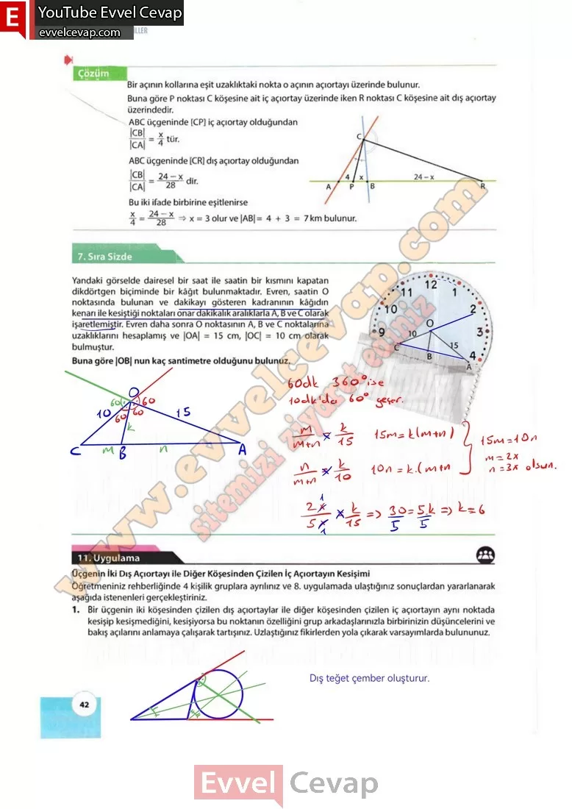

## 10. Sınıf Matematik Ders Kitabı Cevapları Meb Yayınları Sayfa 42

**7. Sıra Sizde**

**Soru: Yandaki görselde dairesel bir saat ile saatin bir kısmını kapatan dikdörtgen biçiminde bir kâğıt bulunmaktadır. Evren, saatin O noktasında bulunan ve dakikayı gösteren kadranının kâğıdın kenarı ile kesiştiği noktaları onar dakikalık aralıklarla A, B ve C olarak işaretlemiştir. Evren daha sonra O noktasının A, B ve C noktalarına uzaklıklarını hesaplamış ve |OA| = 15 cm, |OC| = 10 cm olarak bulmuştur. Buna göre |OB| nun kaç santimetre olduğunu bulunuz.**

**11. Uygulama**

**Üçgenin İki Dış Açıortayı ile Diğer Köşesinden Çizilen İç Açıortayın Kesişimi**

**Soru: Öğretmeniniz rehberliğinde 4 kişilik gruplara ayrılınız ve 8. uygulamada ulaştığınız sonuçlardan yararlanarak aşağıda istenenleri gerçekleştiriniz.**

**Soru: 1) Bir üçgenin iki köşesinden çizilen dış açıortaylar ile diğer köşesinden çizilen iç açıortayın aynı noktada kesişip kesişmediğini, kesişiyorsa bu noktanın özelliğini grup arkadaşlarınızla birbirinizin düşüncelerini ve bakış açılarını anlamaya çalışarak tartışınız. Uzlaştığınız fikirlerden yola çıkarak varsayımlarda bulununuz.**

**10. Sınıf Meb Yayınları Matematik Ders Kitabı Sayfa 42**