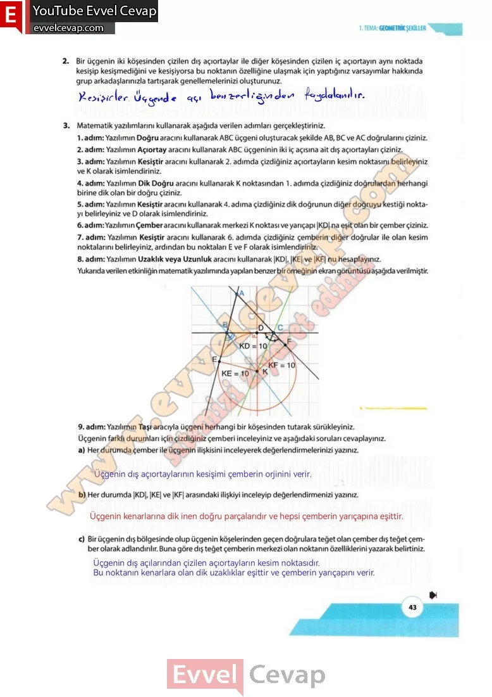

## 10. Sınıf Matematik Ders Kitabı Cevapları Meb Yayınları Sayfa 43

**Soru: 2) Bir üçgenin iki köşesinden çizilen dış açıortaylar ile diğer köşesinden çizilen iç açıortayın aynı noktada kesişip kesişmediğini ve kesişiyorsa bu noktanın özelliğine ulaşmak için yaptığınız varsayımlar hakkında grup arkadaşlarınızla tartışarak genellemelerinizi oluşturunuz.**

**Soru: 3) Matematik yazılımlarını kullanarak aşağıda verilen adımları gerçekleştiriniz.**

1. adım: Yazılımın Doğru aracını kullanarak ABC üçgeni oluşturacak şekilde AB, BC ve AC doğrularını çiziniz.  
 2. adım: Yazılımın Açıortay aracını kullanarak ABC üçgeninin iki iç açısına ait dış açıortayları çiziniz.  
 3. adım: Yazılımın Kesiştir aracını kullanarak 2. adımda çizdiğiniz açıortayların kesim noktasını belirleyiniz ve K olarak isimlendiriniz.  
 4. adım: Yazılımın Dik Doğru aracını kullanarak K noktasından 1. adımda çizdiğiniz doğrulardan herhangi birine dik olan bir doğru çiziniz.  
 5. adım: Yazılımın Kesiştir aracını kullanarak 4. adıma çizdiğiniz dik doğrunun diğer doğruyu kestiği noktayı beiirieyiniz ve D olarak isimlendiriniz.  
 6. adım: Yazılımın Çember aracını kullanarak merkezi K noktası ve yarıçapı |KD| na eşit olan bir çember çiziniz.  
 7. adım: Yazılımın Kesiştir aracını kullanarak 6. adımda çizdiğiniz çemberin diğer doğrular ile olan kesim noktalarını belirleyiniz, ardından bu noktaları E ve F olarak isimlendiriniz.  
 8. adım: Yazılımın Uzaklık veya Uzunluk aracını kullanarak |KD|, |KE| ve |KF| nu hesaplayını

**Soru: Yazılımın Taşı aracıyla üçgeni herhangi bir köşesinden tutarak sürükleyiniz. Üçgenin farklı durumları için çizdiğiniz çemberi inceleyiniz ve aşağıdaki soruları cevaplayınız.**

**Soru: a) Her durumda çember ile üçgenin ilişkisini inceleyerek değerlendirmelerinizi yazınız.**

**Soru: b) Her durumda |KD|, |KE| ve |KF| arasındaki ilişkiyi inceleyip değerlendirmenizi yazınız.**

**Soru: c) Bir üçgenin dış bölgesinde olup üçgenin köşelerinden geçen doğrulara teğet olan çember dış teğet çember olarak adlandırılır. Buna göre dış teğet çemberin merkezi olan noktanın özelliklerini yazarak belirtiniz.**

**10. Sınıf Meb Yayınları Matematik Ders Kitabı Sayfa 43**