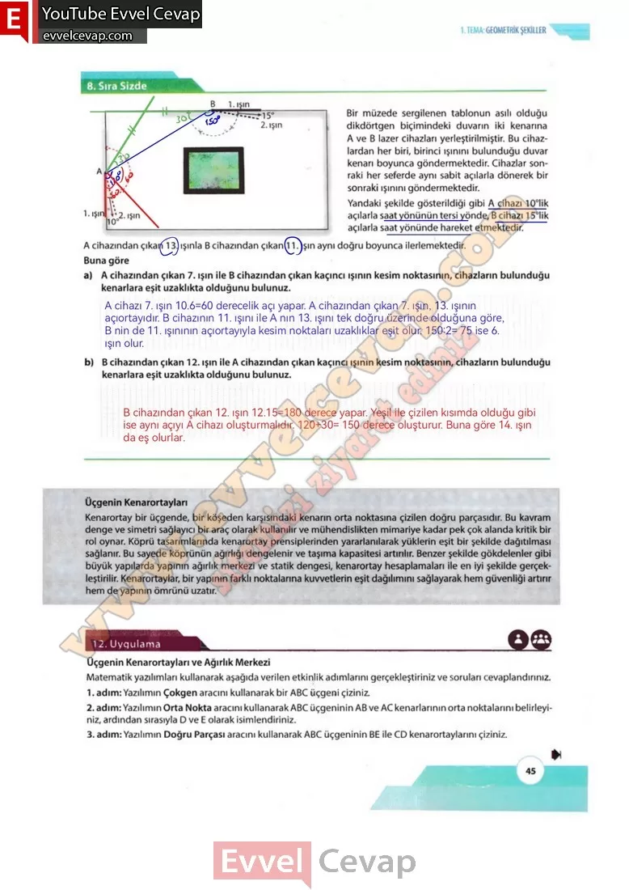

## 10. Sınıf Matematik Ders Kitabı Cevapları Meb Yayınları Sayfa 45

**8. Sıra Sizde**

Bir müzede sergilenen tablonun asılı olduğu dikdörtgen biçimindeki duvarın iki kenarına A ve B lazer cihazları yerleştirilmiştir. Bu cihazlardan her biri, birinci ışınını bulunduğu duvar kenarı boyunca göndermektedir. Cihazlar sonraki her seferde aynı sabit açılarla dönerek bir sonraki ışınını göndermektedir.  
 Yandaki şekilde gösterildiği gibi A cihazı 10°lik açılarla saat yönünün tersi yönde, B cihazı 15°lik açılarla saat yönünde hareket etmektedir.  
 A cihazından çıkan 13. ışınla B cihazından çıkan 11. ışın aynı doğru boyunca ilerlemektedir. Buna göre

**Soru: a) A cihazından çıkan 7. ışın ile B cihazından çıkan kaçıncı ışının kesim noktasının, cihazların bulunduğu kenarlara eşit uzaklıkta olduğunu bulunuz.**

**Soru: b) B cihazından çıkan 12. ışın ile A cihazından çıkan kaçıncı ışının kesim noktasının, cihazların bulunduğu kenarlara eşit uzaklıkta olduğunu bulunuz.**

Üçgenin Kenarortayları  
 Kenarortay bir üçgende, bir köşeden karşısındaki kenarın orta noktasına çizilen doğru parçasıdır. Bu kavram denge ve simetri sağlayıcı bir araç olarak kullanılır ve mühendislikten mimariye kadar pek çok alanda kritik bir rol oynar. Köprü tasarımlarında kenarortay prensiplerinden yararlanılarak yüklerin eşit bir şekilde dağıtılması sağlanır. Bu sayede köprünün ağırlığı dengelenir ve taşıma kapasitesi artırılır. Benzer şekilde gökdelenler gibi büyük yapılarda yapının ağırlık merkezi ve statik dengesi, kenarortay hesaplamaları ile en iyi şekilde gerçekleştirilir. Kenarortaylar, bir yapının farklı noktalarına kuvvetlerin eşit dağılımını sağlayarak hem güvenliği artırır hem de yapının ömrünü uzatır.

**12. Uygulama**

**Üçgenin Kenarortayları ve Ağırlık Merkezi**

**Soru: Matematik yazılımları kullanarak aşağıda verilen etkinlik adımlarını gerçekleştiriniz ve soruları cevaplandırınız.**

**Soru: Yazılımın Çokgen aracını kullanarak bir ABC üçgeni çiziniz.**

**Soru: Yazılımın Orta Nokta aracını kullanarak ABC üçgeninin AB ve AC kenarlarının orta noktalarını belirleyiniz, ardından sırasıyla D ve E olarak isimlendiriniz.**

**Soru: Yazılımın Doğru Parçası aracını kullanarak ABC üçgeninin BE ile CD kenarortaylarını çiziniz.**

**10. Sınıf Meb Yayınları Matematik Ders Kitabı Sayfa 45**