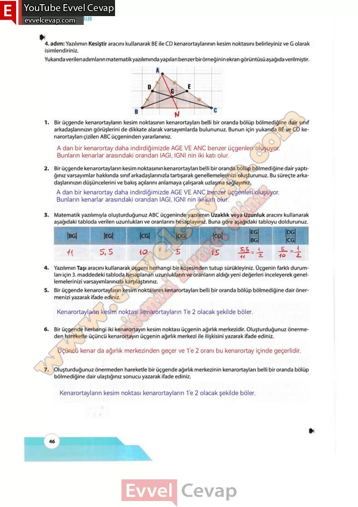

## 10. Sınıf Matematik Ders Kitabı Cevapları Meb Yayınları Sayfa 46

**Soru: Yazılımın Kesiştir aracını kullanarak BE ile CD kenarortaylarının kesim noktasını belirleyiniz ve G olarak isimlendiriniz. Yukarıda verilen adımların matematik yazılımında yapılan benzer bir örneğinin ekran görüntüsü aşağıda verilmiştir.**

**Soru: 1) Bir üçgende kenarortayların kesim noktasının kenarortayları belli bir oranda bölüp bölmediğine dair sınıf arkadaşlarınızın görüşlerini de dikkate alarak varsayımlarda bulununuz. Bunun için yukarıda BE ve CD kenarortayları çizilen ABC üçgeninden yararlanınız.**

**Soru: 2) Bir üçgende kenarortayların kesim noktasının kenarortayları belli bir oranda bölüp bölmediğine dair yaptığınız varsayımlar hakkında sınıf arkadaşlarınızla tartışarak genellemelerinizi oluşturunuz. Bu süreçte arkadaşlarınızın düşüncelerini ve bakış açılarını anlamaya çalışarak uzlaşma sağlayınız.**

**Soru: 3) Matematik yazılımıyla oluşturduğunuz ABC üçgeninde yazılımın Uzaklık veya Uzunluk aracını kullanarak aşağıdaki tabloda verilen uzunlukları ve oranlarını hesaplayınız. Buna göre aşağıdaki tabloyu doldurunuz.**

**Soru: 5) Bir üçgende kenarortayların kesim noktasının kenarortayları belli bir oranda bölüp bölmediğine dair önermenizi yazarak ifade ediniz.**

**Soru: 6) Bir üçgende herhangi iki kenarortayın kesim noktası üçgenin ağırlık merkezidir. Oluşturduğunuz önermeden hareketle üçüncü kenarortayın üçgenin ağırlık merkezi ile ilişkisini yazarak ifade ediniz.**

**Soru: 7) Oluşturduğunuz önermeden hareketle bir üçgende ağırlık merkezinin kenarortayları belli bir oranda bölüp bölmediğine dair ulaştığınız sonucu yazarak ifade ediniz.**

**10. Sınıf Meb Yayınları Matematik Ders Kitabı Sayfa 46**