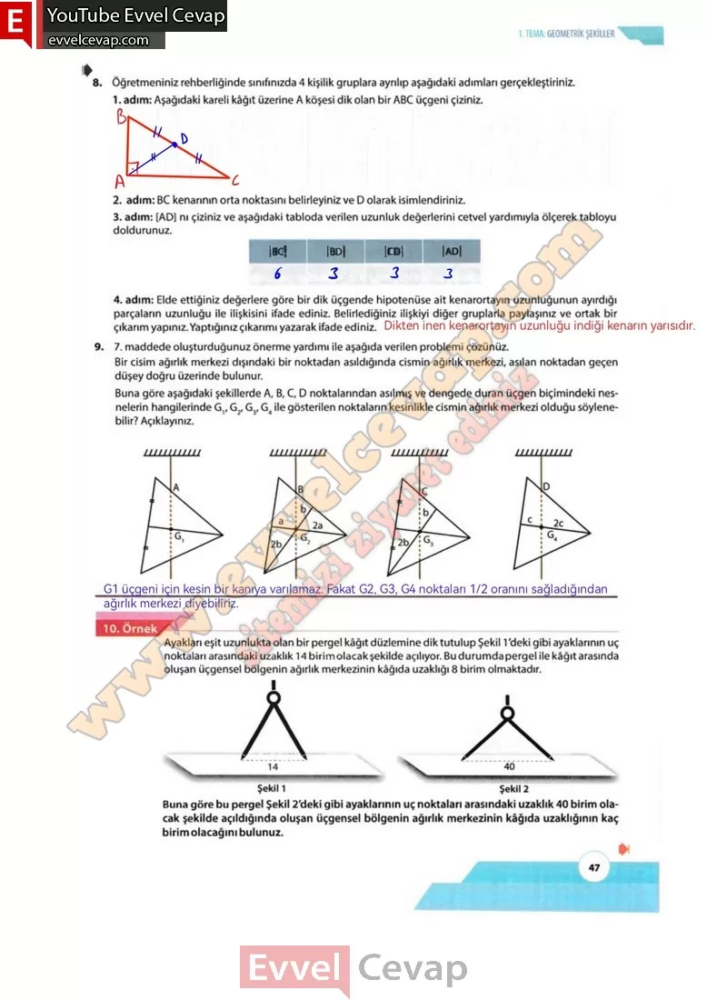

## 10. Sınıf Matematik Ders Kitabı Cevapları Meb Yayınları Sayfa 47

**Soru: 8) Öğretmeniniz rehberliğinde sınıfınızda 4 kişilik gruplara ayrılıp aşağıdaki adımları gerçekleştiriniz.**

**Soru: : Aşağıdaki kareli kâğıt üzerine A köşesi dik olan bir ABC üçgeni çiziniz.**

**Soru: BC kenarının orta noktasını belirleyiniz ve D olarak isimlendiriniz.**

**Soru: [AD] nı çiziniz ve aşağıdaki tabloda verilen uzunluk değerlerini cetvel yardımıyla ölçerek tabloyu doldurunuz.**

**Soru: Elde ettiğiniz değerlere göre bir dik üçgende hipotenüse ait kenarortayın uzunluğunun ayırdığı parçaların uzunluğu ile ilişkisini ifade ediniz. Belirlediğiniz ilişkiyi diğer gruplarla paylaşınız ve ortak bir çıkarım yapınız. Yaptığınız çıkarımı yazarak ifade ediniz.**

**Soru: 9) 7. maddede oluşturduğunuz önerme yardımı ile aşağıda verilen problemi çözünüz. Bir cisim ağırlık merkezi dışındaki bir noktadan asıldığında cismin ağırlık merkezi, asılan noktadan geçen düşey doğru üzerinde bulunur. Buna göre aşağıdaki şekillerde A, B, C, D noktalarından asılmış ve dengede duran üçgen biçimindeki nesnelerin hangilerinde G,, G2, G3, G4 ile gösterilen noktaların kesinlikle cismin ağırlık merkezi olduğu söylenebilir? Açıklayınız.**

Ayakları eşit uzunlukta olan bir pergel kâğıt düzlemine dik tutulup Şekil 1 ‘deki gibi ayaklarının uç noktaları arasındaki uzaklık 14 birim olacak şekilde açılıyor. Bu durumda pergel ile kâğıt arasında oluşan üçgensel bölgenin ağırlık merkezinin kâğıda uzaklığı 8 birim olmaktadır. Buna göre bu pergel Şekil 2’deki gibi ayaklarının uç noktaları arasındaki uzaklık 40 birim olacak şekilde açıldığında oluşan üçgensel bölgenin ağırlık merkezinin kâğıda uzaklığının kaç birim olacağını bulunuz.

**10. Sınıf Meb Yayınları Matematik Ders Kitabı Sayfa 47**