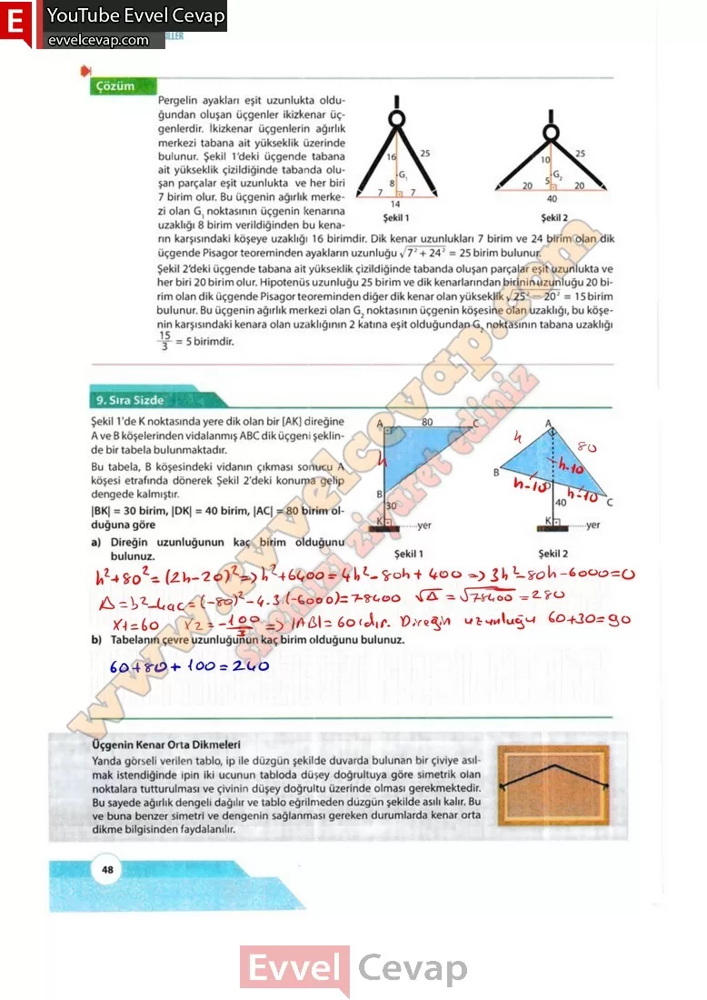

## 10. Sınıf Matematik Ders Kitabı Cevapları Meb Yayınları Sayfa 48

Pergelin ayakları eşit uzunlukta olduğundan oluşan üçgenler ikizkenar üçgenlerdir. İkizkenar üçgenlerin ağırlık merkezi tabana ait yükseklik üzerinde bulunur. Şekil 1’deki üçgende tabana ait yükseklik çizildiğinde tabanda oluşan parçalar eşit uzunlukta ve her biri 7 birim olur. Bu üçgenin ağırlık merkezi olan G1 noktasının üçgenin kenarına uzaklığı 8 birim verildiğinden bu kenarın karşısındaki köşeye uzaklığı 16 birimdir. Dik kenar uzunlukları 7 birim ve 24 birim olan dik üçgende Pisagor teoreminden ayakların uzunluğu y/72 + 242 = 25 birim bulunur. Şekil 2’deki üçgende tabana ait yükseklik çizildiğinde tabanda oluşan parçalar eşit uzunlukta ve her biri 20 birim olur. Hipotenüs uzunluğu 25 birim ve dik kenarlarından birinin uzunluğu 20 birim olan dik üçgende Pisagor teoreminden diğer dik kenar olan yükseklik y/252 — 202 = 15 birim bulunur. Bu üçgenin ağırlık merkezi olan G2 noktasının üçgenin köşesine olan uzaklığı, bu köşenin karşısındaki kenara olan uzaklığının 2 katına eşit olduğundan G. noktasının tabana uzaklığı

**9. Sıra Sizde**

**Soru: Şekil 1 ‘de K noktasında yere dik olan bir [AK] direğine A ve B köşelerinden vidalanmış ABC dik üçgeni şeklinde bir tabela bulunmaktadır. Bu tabela, B köşesindeki vidanın çıkması sonucu A köşesi etrafında dönerek Şekil 2’deki konuma gelip dengede kalmıştır. “|BK| = 30 birim, |DK| = 40 birim, |AC| = 80 birim olduğuna göre**

**Soru: a) Direğin uzunluğunun kaç birim olduğunu bulunuz.**

**Soru: b) Tabelanın çevre uzunluğunun kaç birim olduğunu bulunuz.**

**Üçgenin Kenar Orta Dikmeleri**

Yanda görseli verilen tablo, ip ile düzgün şekilde duvarda bulunan bir çiviye asılmak istendiğinde ipin iki ucunun tabloda düşey doğrultuya göre simetrik olan noktalara tutturulması ve çivinin düşey doğrultu üzerinde olması gerekmektedir. Bu sayede ağırlık dengeli dağılır ve tablo eğrilmeden düzgün şekilde asılı kalır. Bu ve buna benzer simetri ve dengenin sağlanması gereken durumlarda kenar orta dikme bilgisinden faydalanılır.

**10. Sınıf Meb Yayınları Matematik Ders Kitabı Sayfa 48**