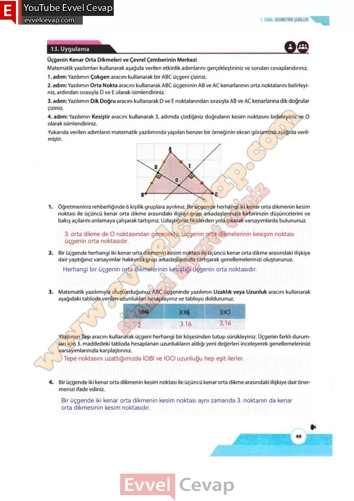

## 10. Sınıf Matematik Ders Kitabı Cevapları Meb Yayınları Sayfa 49

**13. Uygulama**

**Üçgenin Kenar Orta Dikmeleri ve Çevrel Çemberinin Merkezi**

**Soru: Matematik yazılımları kullanarak aşağıda verilen etkinlik adımlarını gerçekleştiriniz ve soruları cevaplandırınız.**

1. adım: Yazılımın Çokgen aracını kullanarak bir ABC üçgeni çiziniz.  
 2. adım: Yazılımın Orta Nokta aracını kullanarak ABC üçgeninin AB ve AC kenarlarının orta noktalarını belirleyiniz, ardından sırasıyla D ve E olarak isimlendiriniz.  
 3. adım: Yazılımın Dik Doğru aracını kullanarak D ve E noktalarından sırasıyla AB ve AC kenarlarına dik doğrular çiziniz.  
 4. adım: Yazılımın Kesiştir aracını kullanarak 3. adımda çizdiğiniz doğruların kesim noktasını belirleyiniz ve O olarak isimlendiriniz.  
 Yukarıda verilen adımların matematik yazılımında yapılan benzer bir örneğinin ekran görüntüsü aşağıda verilmiştir.

**Soru: 1) Öğretmeniniz rehberliğinde 6 kişilik gruplara ayrılınız. Bir üçgende herhangi iki kenar orta dikmenin kesim noktası ile üçüncü kenar orta dikme arasındaki ilişkiyi grup arkadaşlarınızla birbirinizin düşüncelerini ve bakış açılarını anlamaya çalışarak tartışınız. Uzlaştığınız fikirlerden yola çıkarak varsayımlarda bulununuz.**

**Soru: 2) Bir üçgende herhangi iki kenar orta dikmenin kesim noktası ile üçüncü kenar orta dikme arasındaki ilişkiye dair yaptığınız varsayımlar hakkında grup arkadaşlarınızla tartışarak genellemelerinizi oluşturunuz.**

**Soru: 3) Matematik yazılımıyla oluşturduğunuz ABC üçgeninde yazılımın Uzaklık veya Uzunluk aracını kullanarak aşağıdaki tabloda verilen uzunlukları hesaplayınız ve tabloyu doldurunuz. Yazılımın Taşı aracını kullanarak üçgeni herhangi bir köşesinden tutup sürükleyiniz. Üçgenin farklı durumları için 3. maddedeki tabloda hesaplanan uzunlukların aldığı yeni değerleri inceleyerek genellemelerinizi varsayımlarınızla karşılaştırınız.**

**Soru: 4) Bir üçgende iki kenar orta dikmenin kesim noktası ile üçüncü kenar orta dikme arasındaki ilişkiye dair önermenizi ifade ediniz.**

**10. Sınıf Meb Yayınları Matematik Ders Kitabı Sayfa 49**