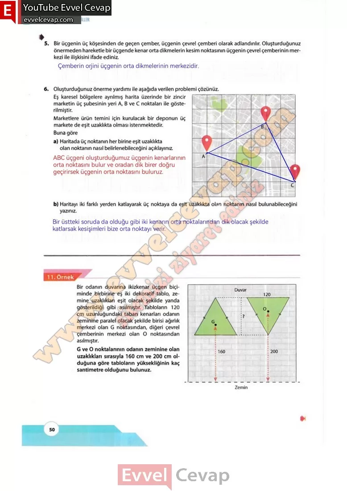

## 10. Sınıf Matematik Ders Kitabı Cevapları Meb Yayınları Sayfa 50

**Soru: 5) Bir üçgenin üç köşesinden de geçen çember, üçgenin çevre! çemberi olarak adlandırılır. Oluşturduğunuz önermeden hareketle bir üçgende kenar orta dikmelerin kesim noktasının üçgenin çevrel çemberinin merkezi ile ilişkisini ifade ediniz.**

**Soru: 6) Oluşturduğunuz önerme yardımı ile aşağıda verilen problemi çözünüz. Eş karesel bölgelere ayrılmış harita üzerinde bir zincir marketin üç şubesinin yeri A, B ve C noktaları ile gösterilmiştir. Marketlere ürün temini için kurulacak bir deponun üç markete de eşit uzaklıkta olması istenmektedir. Buna göre**

**Soru: a) Haritada üç noktanın her birine eşit uzaklıkta olan noktanın nasıl belirlenebileceğini açıklayınız.**

**Soru: b) Haritayı iki farklı yerden katlayarak üç noktaya da eşit uzaklıkta olan noktanın nasıl bulunabileceğini yazınız.**

Bir odanın duvarına ikizkenar üçgen biçiminde birbirine eş iki dekoratif tablo, zemine uzaklıkları eşit olacak şekilde yanda gösterildiği gibi asılmıştır. Tabloların 120 cm uzunluğundaki taban kenarları odanın zeminine paralel olacak şekilde birisi ağırlık merkezi olan G noktasından, diğeri çevrel çemberinin merkezi olan O noktasından asılmıştır.  
 G ve O noktalarının odanın zeminine olan uzaklıklara sırasıyla 160 cm ve 200 cm olduğuna göre tabloların yüksekliğinin kaç santimetre olduğunu bulunuz.

**10. Sınıf Meb Yayınları Matematik Ders Kitabı Sayfa 50**