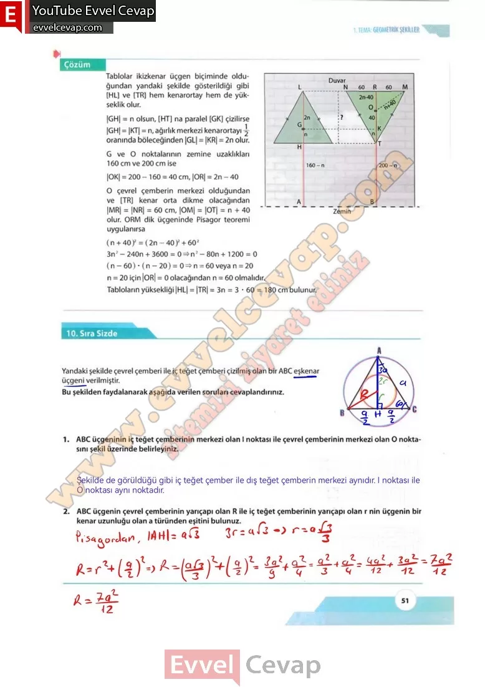

## 10. Sınıf Matematik Ders Kitabı Cevapları Meb Yayınları Sayfa 51

Tablolar ikizkenar üçgen biçiminde olduğundan yandaki şekilde gösterildiği gibi [HL] ve [TR] hem kenarortay hem de yükseklik olur.  
 |GH| = n olsun, [HT] na paralel [GK] çizilirse  
 |GH| = |KT| = n, ağırlık merkezi kenarortayı y oranında böleceğinden |GL| = |KR| = 2n olur.  
 G ve O noktalarının zemine uzaklıkları 160 cm ve 200 cm ise  
 |OK| = 200- 160 = 40 cm, |OR| = 2n – 40  
 0 çevrel çemberin merkezi olduğundan ve [TR] kenar orta dikme olacağından İMRİ = İNRİ = 60 rm. İOMİ = İOTİ = n 4- 40 olur. ORM dik üçgeninde Pisagor teoremi uygulanırsa  
 (n + 40)2 = (2n —40)2 + 602 3n2 – 240n + 3600 = 0 =» n2 – 80n + 1200 = 0 (n – 60) • (n – 20) = 0=> n = 60 veya n = 20 n = 20 için |OR| = 0 olacağından n = 60 olmalıdır.  
 Tabloların yüksekliği |HL| = |TR| = 3n = 3 • 60 = 180 cm bulunur.

**10) Sıra Sizde**

**Soru: Yandaki şekilde çevrel çemberi ile iç teğet çemberi çizilmiş olan bir ABC eşkenar üçgeni verilmiştir. Bu şekilden faydalanarak aşağıda verilen soruları cevaplandırınız.**

**Soru: 1) ABC üçgeninin iç teğet çemberinin merkezi olan I noktası ile çevrel çemberinin merkezi olan O noktasını şekil üzerinde belirleyiniz.**

**Soru: 2) ABC üçgenin çevrel çemberinin yarıçapı olan R ile iç teğet çemberinin yarıçapı olan r nin üçgenin bir kenar uzunluğu olan a türünden eşitini bulunuz.**

**10. Sınıf Meb Yayınları Matematik Ders Kitabı Sayfa 51**