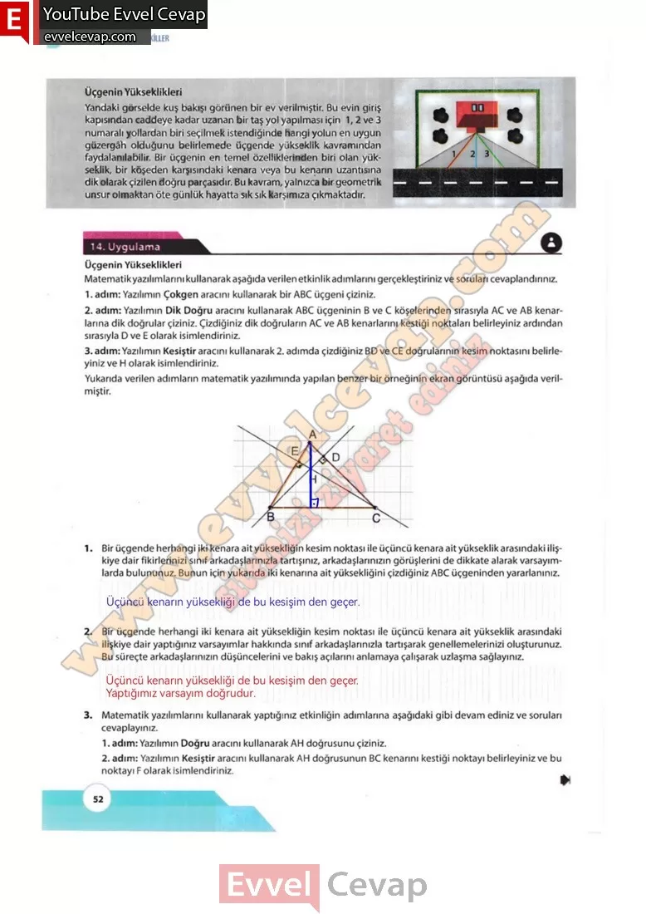

## 10. Sınıf Matematik Ders Kitabı Cevapları Meb Yayınları Sayfa 52

Üçgenin Yükseklikleri  
 Yandaki görselde kuş bakışı görünen bir ev verilmiştir. Bu evin giriş kapısından caddeye kadar uzanan bir taş yol yapılması için 1,2 ve 3 numaralı yollardan biri seçilmek istendiğinde hangi yolun en uygun güzergâh olduğunu belirlemede üçgende yükseklik kavramından faydalanılabilir. Bir üçgenin en temel özelliklerinden biri olan yükseklik, bir köşeden karşısındaki kenara veya bu kenarın uzantısına dik olarak çizilen doğru parçasıdır. Bu kavram, yalnızca bir geometrik unsur olmaktan öte günlük hayatta sık sık karşımıza çıkmaktadır.

**Uygulama**

**Üçgenin Yükseklikleri**

**Soru: Matematik yazılımlarını kullanarak aşağıda verilen etkinlik adımlarını gerçekleştiriniz ve soruları cevaplandırınız.**

1. adım: Yazılımın Çokgen aracını kullanarak bir ABC üçgeni çiziniz.  
 2. adım: Yazılımın Dik Doğru aracını kullanarak ABC üçgeninin B ve C köşelerinden sırasıyla AC ve AB kenarlarına dik doğrular çiziniz. Çizdiğiniz dik doğruların AC ve AB kenarlarını kestiği noktaları belirleyiniz ardından sırasıyla D ve E olarak isimlendiriniz.  
 3. adım: Yazılımın Kesiştir aracını kullanarak 2. adımda çizdiğiniz BD ve CE doğrularının kesim noktasını belirleyiniz ve H olarak isimlendiriniz.  
 Yukarıda verilen adımların matematik yazılımında yapılan benzer bir örneğinin ekran görüntüsü aşağıda verilmiştir.

**Soru: 1) Bir üçgende herhangi iki kenara ait yüksekliğin kesim noktası ile üçüncü kenara ait yükseklik arasındaki ilişkiye dair fikirlerinizi sınıf arkadaşlarınızla tartışınız, arkadaşlarınızın görüşlerini de dikkate alarak varsayımlarda bulununuz. Bunun için yukarıda iki kenarına ait yüksekliğini çizdiğiniz ABC üçgeninden yararlanınız.**

**Soru: 2) Bir üçgende herhangi iki kenara ait yüksekliğin kesim noktası ile üçüncü kenara ait yükseklik arasındaki ilişkiye dair yaptığınız varsayımlar hakkında sınıf arkadaşlarınızla tartışarak genellemelerinizi oluşturunuz. Bu süreçte arkadaşlarınızın düşüncelerini ve bakış açılarını anlamaya çalışarak uzlaşma sağlayınız.**

**Soru: 3) Matematik yazılımlarını kullanarak yaptığınız etkinliğin adımlarına aşağıdaki gibi devam ediniz ve sorulan cevaplayınız.**

**Soru: Yazılımın Doğru aracını kullanarak AH doğrusunu çiziniz.**

**Soru: Yazılımın Kesiştir aracını kullanarak AH doğrusunun BC kenarını kestiği noktayı belirleyiniz ve bu noktayı F olarak isimlendiriniz.**

**10. Sınıf Meb Yayınları Matematik Ders Kitabı Sayfa 52**