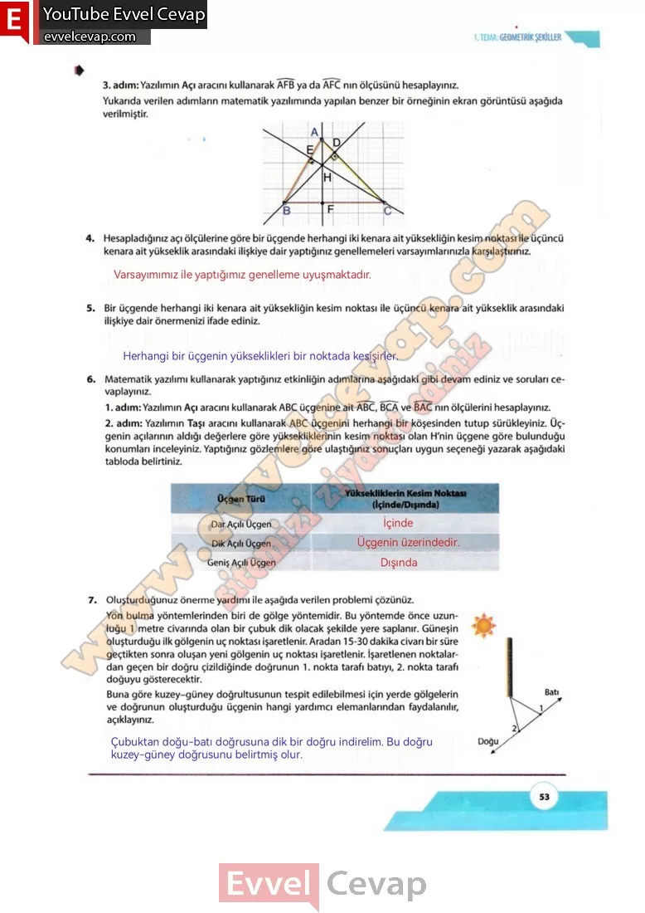

## 10. Sınıf Matematik Ders Kitabı Cevapları Meb Yayınları Sayfa 53

**Soru: Yazılımın Açı aracını kullanarak AFB ya da AFC nın ölçüsünü hesaplayınız. Yukarıda verilen adımların matematik yazılımında yapılan benzer bir örneğinin ekran görüntüsü aşağıda verilmiştir.**

**Soru: 4) Hesapladığınız açı ölçülerine göre bir üçgende herhangi iki kenara ait yüksekliğin kesim noktası ile üçüncü kenara ait yükseklik arasındaki ilişkiye dair yaptığınız genellemeleri varsayımlarınızla karşılaştırınız.**

**Soru: 5) Bir üçgende herhangi iki kenara ait yüksekliğin kesim noktası ile üçüncü kenara ait yükseklik arasındaki ilişkiye dair önermenizi ifade ediniz.**

**Soru: 6) Matematik yazılımı kullanarak yaptığınız etkinliğin adımlarına aşağıdaki gibi devam ediniz ve soruları cevaplayınız.**

**Soru: Yazılımın Açı aracını kullanarak ABC üçgenine ait ABC, BCA ve BAC nın ölçülerini hesaplayınız.**

**Soru: Yazılımın Taşı aracını kullanarak ABC üçgenini herhangi bir köşesinden tutup sürükleyiniz. Üçgenin açılarının aldığı değerlere göre yüksekliklerinin kesim noktası olan H’nin üçgene göre bulunduğu konumları inceleyiniz. Yaptığınız gözlemlere göre ulaştığınız sonuçları uygun seçeneği yazarak aşağıdaki tabloda belirtiniz.**

**Soru: 7) Oluşturduğunuz önerme yardımı ile aşağıda verilen problemi çözünüz.**

Yön bulma yöntemlerinden biri de gölge yöntemidir. Bu yöntemde önce uzunluğu 1 metre civarında olan bir çubuk dik olacak şekilde yere saplanır. Güneşin oluşturduğu ilk gölgenin uç noktası işaretlenir. Aradan 15-30 dakika civarı bir süre geçtikten sonra oluşan yeni gölgenin uç noktası işaretlenir. İşaretlenen noktalardan geçen bir doğru çizildiğinde doğrunun 1. nokta tarafı batıyı, 2. nokta tarafı doğuyu gösterecektir. Buna göre kuzey-güney doğrultusunun tespit edilebilmesi için yerde gölgelerin ve doğrunun oluşturduğu üçgenin hangi yardımcı elemanlarından faydalanılır, açıklayınız.

**10. Sınıf Meb Yayınları Matematik Ders Kitabı Sayfa 53**