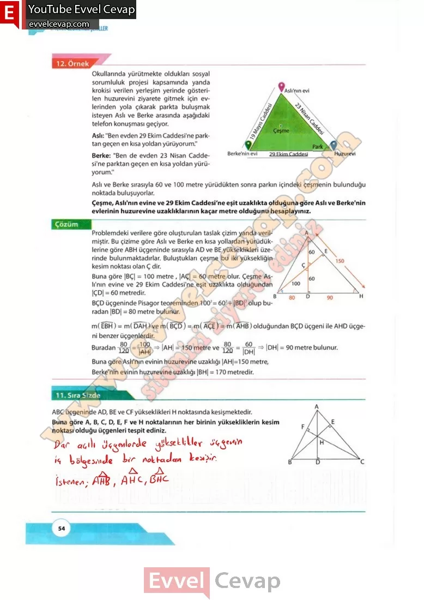

## 10. Sınıf Matematik Ders Kitabı Cevapları Meb Yayınları Sayfa 54

Okullarında yürütmekte oldukları sosyal sorumluluk projesi kapsamında yanda krokisi verilen yerleşim yerinde gösterilen huzurevini ziyarete gitmek için evlerinden yola çıkarak parkta buluşmak isteyen Aslı ve Berke arasında aşağıdaki telefon konuşması geçiyor.  
 Aslı: “Ben evden 29 Ekim Caddesi’ne parktan geçen en kısa yoldan yürüyorum.”  
 Berke: “Ben de evden 23 Nisan Caddesi’ne parktan geçen en kısa yoldan yürüyorum.”  
 Aslı ve Berke sırasıyla 60 ve 100 metre yürüdükten sonra parkın içindeki çeşmenin bulunduğu noktada buluşuyorlar.  
 Çeşme, Aslı’nın evine ve 29 Ekim Caddesi’ne eşit uzaklıkta olduğuna göre Aslı ve Berke’nin evlerinin huzurevine uzaklıklarının kaçar metre olduğunu hesaplayınız.

Problemdeki verilere göre oluşturulan taslak çizim yanda verilmiştir. Bu çizime göre Aslı ve Berke en kısa yollardan yürüdüklerine göre ABH üçgeninde sırasıyla AD ve BE yükseklikleri üzerinde bulunmaktadırlar. Buluştukları çeşme bu iki yüksekliğin kesim noktası olan Ç dir.

**11. Sıra Sizde**

**Soru: ABC üçgeninde AD, BE ve CF yükseklikleri H noktasında kesişmektedir. Buna göre A, B, C, D, E, F ve H noktalarının her birinin yüksekliklerin kesim noktası olduğu üçgenleri tespit ediniz.**

**10. Sınıf Meb Yayınları Matematik Ders Kitabı Sayfa 54**