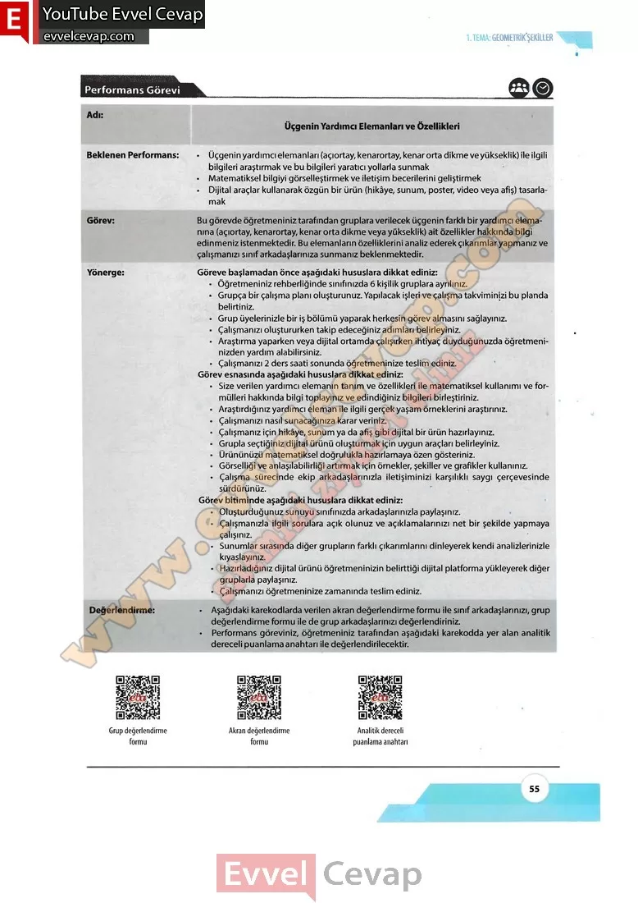

## 10. Sınıf Matematik Ders Kitabı Cevapları Meb Yayınları Sayfa 55

**Performans Görevi**

Adı: Üçgenin Yardımcı Elemanları ve Özellikleri  
 Beklenen Performans:  
 • Üçgenin yardımcı elemanları (açıortay, kenarortay, kenar orta dikme ve yükseklik) ile ilgili bilgileri araştırmak ve bu bilgileri yaratıcı yollarla sunmak  
 • Matematiksel bilgiyi görselleştirmek ve iletişim becerilerini geliştirmek  
 • Dijital araçlar kullanarak özgün bir ürün (hikâye, sunum, poster, video veya afiş) tasarlamak  
 Görev: Bu görevde öğretmeniniz tarafından gruplara verilecek üçgenin farklı bir yardımcı elemanına (açıortay, kenarortay, kenar orta dikme veya yükseklik) ait özellikler hakkında bilgi edinmeniz istenmektedir. Bu elemanların özelliklerini analiz ederek çıkarımlar yapmanız ve çalışmanızı sınıf arkadaşlarınıza sunmanız beklenmektedir.  
 Yönerge: Göreve başlamadan önce aşağıdaki hususlara dikkat ediniz:  
 • Öğretmeniniz rehberliğinde sınıfınızda 6 kişilik gruplara ayrılınız.  
 • Grupça bir çalışma planı oluşturunuz. Yapılacak işleri ve çalışma takviminizi bu planda belirtiniz.  
 • Grup üyelerinizle bir iş bölümü yaparak herkesin görev almasını sağlayınız.  
 • Çalışmanızı oluştururken takip edeceğiniz adımları belirleyiniz.  
 • Araştırma yaparken veya dijital ortamda çalışırken ihtiyaç duyduğunuzda öğretmeninizden yardım alabilirsiniz.  
 • Çalışmanızı 2 ders saati sonunda öğretmeninize teslim ediniz.  
 Görev esnasında aşağıdaki hususlara dikkat ediniz:  
 • Size verilen yardımcı elemanın tanım ve özellikleri ile matematiksel kullanımı ve formülleri hakkında bilgi toplayınız ve edindiğiniz bilgileri birleştiriniz.  
 • Araştırdığınız yardımcı eleman ile ilgili gerçek yaşam örneklerini araştırınız.  
 • Çalışmanızı nasıl sunacağınıza karar veriniz.  
 • Çalışmanız için hikâye, sunum ya da afiş gibi dijital bir ürün hazırlayınız.  
 • Grupla seçtiğiniz dijital ürünü oluşturmak için uygun araçları belirleyiniz.  
 • Ürününüzü matematiksel doğrulukla hazırlamaya özen gösteriniz.  
 • Görselliği ve anlaşılabilirliği artırmak için örnekler, şekiller ve grafikler kullanınız.  
 • Çalışma sürecinde ekip arkadaşlarınızla iletişiminizi karşılıklı saygı çerçevesinde sürdürünüz.  
 Görev bitiminde aşağıdaki hususlara dikkat ediniz:

**Soru: Oluşturduğunuz sunuyu sınıfınızda arkadaşlarınızla paylaşınız.**

**Soru: Çalışmanızla ilgili sorulara açık olunuz ve açıklamalarınızı net bir şekilde yapmaya çalışınız.**

**Soru: Sunumlar sırasında diğer grupların farklı çıkarımlarını dinleyerek kendi analizlerinizle kıyaslayınız.**

**Soru: Hazırladığınız dijital ürünü öğretmeninizin belirttiği dijital platforma yükleyerek diğer gruplarla paylaşınız.**

**Soru: Çalışmanızı öğretmeninize zamanında teslim ediniz.**

**Değerlendirme:**

**Soru: Aşağıdaki karekodlarda verilen akran değerlendirme formu ile sınıf arkadaşlarınızı, grup değerlendirme formu ile de grup arkadaşlarınızı değerlendiriniz.**

**Soru: Performans göreviniz, öğretmeniniz tarafından aşağıdaki karekodda yer alan analitik dereceli puanlama anahtarı ile değerlendirilecektir.**

**10. Sınıf Meb Yayınları Matematik Ders Kitabı Sayfa 55**