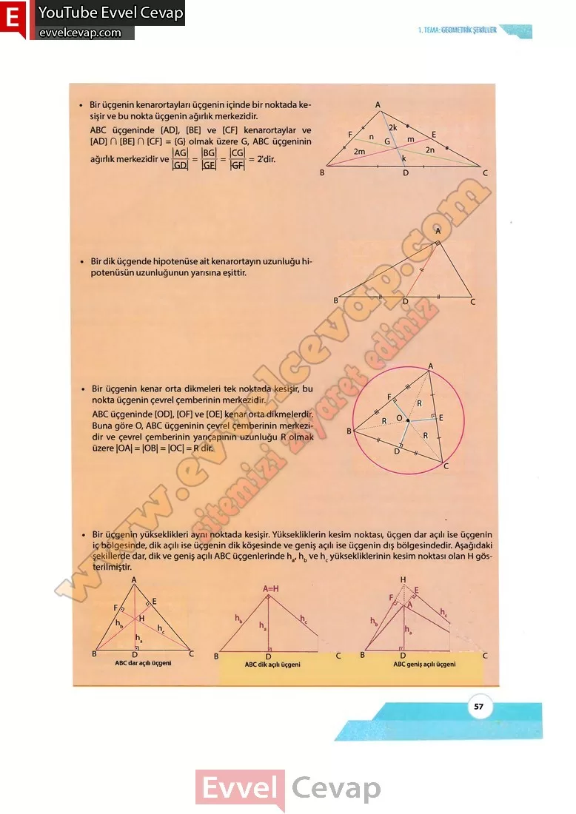

## 10. Sınıf Matematik Ders Kitabı Cevapları Meb Yayınları Sayfa 57

Bir üçgenin kenarortayları üçgenin içinde bir noktada kesişir ve bu nokta üçgenin ağırlık merkezidir. ABC üçgeninde [AD], [BE] ve [CF] kenarortaylar ve [AD] n [BE] fi [CF] = {G} olmak üzere G, ABC üçgeninin  
 Bir dik üçgende hipotenüse ait kenarortayın uzunluğu hipotenüsün uzunluğunun yarısına eşittir.  
 Bir üçgenin kenar orta dikmeleri tek noktada kesişir, bu nokta üçgenin çevrel çemberinin merkezidir.  
 ABC üçgeninde [OD], [OF] ve [OE] kenar orta dikmelerdir. Buna göre O, ABC üçgeninin çevrel çemberinin merkezidir ve çevrel çemberinin yarıçapının uzunluğu R olmak üzere |OA| = |OB| = |OC| = R dir. Bir üçgenin yükseklikleri aynı noktada kesişir. Yüksekliklerin kesim noktası, üçgen dar açılı ise üçgenin iç bölgesinde, dik açılı ise üçgenin dik köşesinde ve geniş açılı ise üçgenin dış bölgesindedir. Aşağıdaki şekillerde dar, dik ve geniş açılı ABC üçgenlerinde ha, hb ve hc yüksekliklerinin kesim noktası olan H gösterilmiştir.

* **Cevap**: **Bu sayfada soru bulunmamaktadır.**

**10. Sınıf Meb Yayınları Matematik Ders Kitabı Sayfa 57**