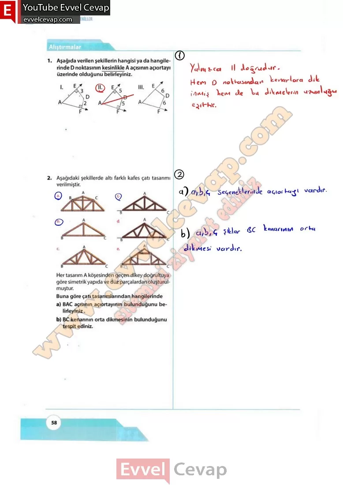
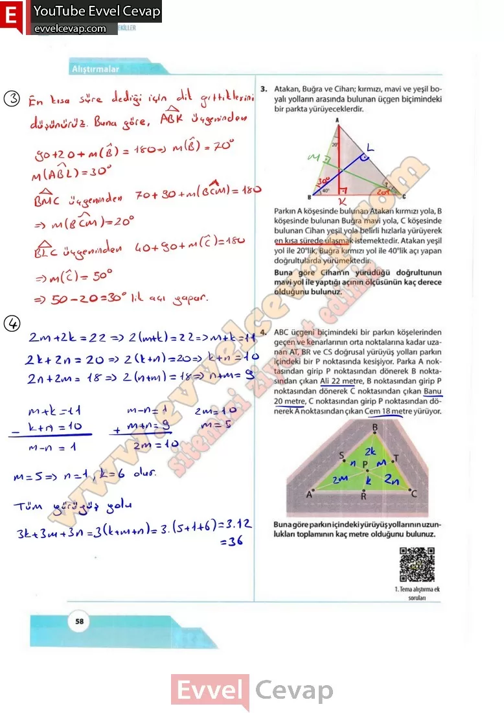

## 10. Sınıf Matematik Ders Kitabı Cevapları Meb Yayınları Sayfa 58

**Alıştırmalar**

**Soru: 1) Aşağıda verilen şekillerin hangisi ya da hangilerinde D noktasının kesinlikle A açısının açıortayı üzerinde olduğunu belirleyiniz.**

**Soru: 2) Aşağıdaki şekillerde altı farklı kafes çatı tasarımı verilmiştir. Her tasarım A köşesinden geçen dikey doğrultuya göre simetrik yapıda ve düz parçalardan oluşturulmuştur. Buna göre çatı tasarımlarından hangilerinde**

**Soru: a) BAC açısının açıortayının bulunduğunu belirleyiniz.**

**Soru: b) BC kenarının orta dikmesinin bulunduğunu tespit ediniz.**

**Soru: 3)** Atakan, Buğra ve Cihan; kırmızı, mavi ve yeşil boyalı yolların arasında bulunan üçgen biçimindeki bir parkta yürüyeceklerdir. Parkın A köşesinde bulunan Atakan kırmızı yola, B köşesinde bulunan Buğra mavi yola, C köşesinde bulunan Cihan yeşil yola belirli hızlarla yürüyerek en kısa sürede ulaşmak istemektedir. Atakan yeşil yol ile 20°lik, Buğra kırmızı yol ile 40°lik açı yapan doğrultularda yürümektedir. **Buna göre Cihan’ın yürüdüğü doğrultunun mavi yol ile yaptığı açının ölçüsünün kaç derece olduğunu bulunuz.**

**Soru: 4)** ABC üçgeni biçimindeki bir parkın köşelerinden geçen ve kenarlarının orta noktalarına kadar uzanan AT, BR ve CS doğrusal yürüyüş yolları parkın içindeki bir P noktasında kesişiyor. Parka A noktasından girip P noktasından dönerek B noktasından çıkan Ali 22 metre, B noktasından girip P noktasından dönerek C noktasından çıkan Banu 20 metre, C noktasından girip P noktasından dönerek A noktasından çıkan Cem 18 metre yürüyor. **Buna göre parkın içindeki yürüyüş yollarının uzunlukları toplamının kaç metre olduğunu bulunuz.**

  
 

**10. Sınıf Meb Yayınları Matematik Ders Kitabı Sayfa 58**