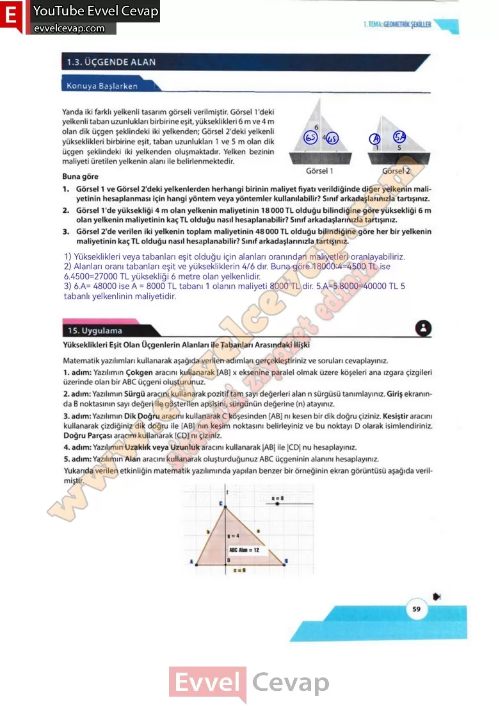

## 10. Sınıf Matematik Ders Kitabı Cevapları Meb Yayınları Sayfa 59

**Konuya Başlarken**

Yanda iki farklı yelkenli tasarım görseli verilmiştir. Görsel 1 ‘deki yelkenli taban uzunlukları birbirine eşit, yükseklikleri 6 m ve 4 m olan dik üçgen şeklindeki iki yelkenden; Görsel 2’deki yelkenli yükseklikleri birbirine eşit, taban uzunlukları 1 ve 5 m olan dik üçgen şeklindeki iki yelkenden oluşmaktadır. Yelken bezinin maliyeti üretilen yelkenin alanı ile belirlenmektedir. Buna göre

**Soru: 1) Görsel 1 ve Görsel 2’deki yelkenlerden herhangi birinin maliyet fiyatı verildiğinde diğer yelkenin maliyetinin hesaplanması için hangi yöntem veya yöntemler kullanılabilir? Sınıf arkadaşlarınızla tartışınız.**

**Soru: 2) Görsel 1 ‘de yüksekliği 4 m olan yelkenin maliyetinin 18 000 TL olduğu bilindiğine göre yüksekliği 6 m olan yelkenin maliyetinin kaç TL olduğu nasıl hesaplanabilir? Sınıf arkadaşlarınızla tartışınız.**

**Soru: 3) Görsel 2’de verilen iki yelkenin toplam maliyetinin 48000 TL olduğu bilindiğine göre her bir yelkenin maliyetinin kaç TL olduğu nasıl hesaplanabilir? Sınıf arkadaşlarınızla tartışınız.**

Bir üçgenin alanını belirleyen temel elemanlar kenar uzunlukları ve o kenara ait yüksekliklerdir. Günlük yaşamda karşılaşılan üçgen şeklindeki materyal, bahçe veya arazi gibi bölgelerin alanlarına dair çıkarımlar yapılırken kenar uzunlukları ve o kenara ait yükseklikler arasındaki ilişki dikkate alınır.

**15. Uygulama**

**Soru: Matematik yazılımları kullanarak aşağıda verilen adımları gerçekleştiriniz ve soruları cevaplayınız.**

1. adım: Yazılımın Çokgen aracını kullanarak [AB] x eksenine paralel olmak üzere köşeleri ana ızgara çizgileri üzerinde olan bir ABC üçgeni oluşturunuz.  
 2. adım: Yazılımın Sürgü aracını kullanarak pozitif tam sayı değerleri alan n sürgüsü tanımlayınız. Giriş ekranında B noktasının sayı değeri ile gösterilen apsisini, sürgünün değerine (n) atayınız.  
 3. adım: Yazılımın Dik Doğru aracını kullanarak C köşesinden [AB] nı kesen bir dik doğru çiziniz. Kesiştir aracını kullanarak çizdiğiniz dik doğru ile [AB] nın kesim noktasını belirleyiniz ve bu noktayı D olarak isimlendiriniz. Doğru Parçası aracını kullanarak [CD] nı çiziniz.  
 4. adım: Yazılımın Uzaklık veya Uzunluk aracını kullanarak |AB| ile |CD| nu hesaplayınız.  
 5. adım: Yazılımın Alan aracını kullanarak oluşturduğunuz ABC üçgeninin alanını hesaplayınız.  
 Yukarıda verilen etkinliğin matematik yazılımında yapılan benzer bir örneğinin ekran görüntüsü aşağıda verilmiştir.

**10. Sınıf Meb Yayınları Matematik Ders Kitabı Sayfa 59**