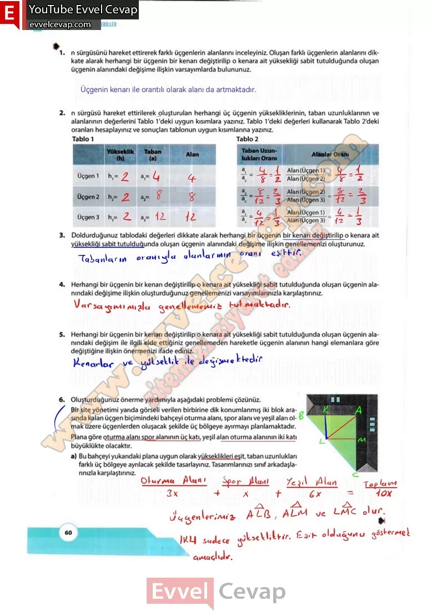

## 10. Sınıf Matematik Ders Kitabı Cevapları Meb Yayınları Sayfa 60

**Soru: 1) n sürgüsünü hareket ettirerek farklı üçgenlerin alanlarını inceleyiniz. Oluşan farklı üçgenlerin alanlarını dikkate alarak herhangi bir üçgenin bir kenarı değiştirilip o kenara ait yüksekliği sabit tutulduğunda oluşan üçgenin alanındaki değişime ilişkin varsayımlarda bulununuz.**

**Soru: 2) n sürgüsü hareket ettirilerek oluşturulan herhangi üç üçgenin yüksekliklerinin, taban uzunluklarının ve alanlarının değerlerini Tablo 1 ‘deki uygun kısımlara yazınız. Tablo 1 ‘deki değerleri kullanarak Tablo 2’deki oranları hesaplayınız ve sonuçları tablonun uygun kısımlarına yazınız.**

**Soru: 3) Doldurduğunuz tablodaki değerleri dikkate alarak herhangi bir üçgenin bir kenarı değiştirilip o kenara ait yüksekliği sabit tutulduğunda oluşan üçgenin alanındaki değişime ilişkin genellemenizi oluşturunuz.**

**Soru: 4) Herhangi bir üçgenin bir kenarı değiştirilip o kenara ait yüksekliği sabit tutulduğunda oluşan üçgenin alanındaki değişime ilişkin oluşturduğunuz genellemenizi varsayımlarınızla karşılaştırınız.**

**Soru: 5) Herhangi bir üçgenin bir kenarı değiştirilip o kenara ait yüksekliği sabit tutulduğunda oluşan üçgenin alanındaki değişim ile ilgili elde ettiğiniz genellemeden hareketle üçgenin alanının hangi elemanlara göre değiştiğine ilişkin önermenizi ifade ediniz.**

**Soru: 6) Oluşturduğunuz önerme yardımıyla aşağıdaki problemi çözünüz. Bir site yönetimi yanda görseli verilen birbirine dik konumlanmış iki blok arasında kalan üçgen biçimindeki bahçeyi oturma alanı, spor alanı ve yeşil alan olmak üzere üçgenlerden oluşacak şekilde üç bölgeye ayırmayı planlamaktadır. Plana göre oturma alanı spor alanının üç katı, yeşil alan oturma alanının iki katı büyüklükte olacaktır.**

**Soru: a) Bu bahçeyi yukarıdaki plana uygun olarak yükseklikleri eşit, taban uzunlukları farklı üç bölgeye ayrılacak şekilde tasarlayınız. Tasarımlarınızı sınıf arkadaşlarınızla karşılaştırınız.**

**10. Sınıf Meb Yayınları Matematik Ders Kitabı Sayfa 60**