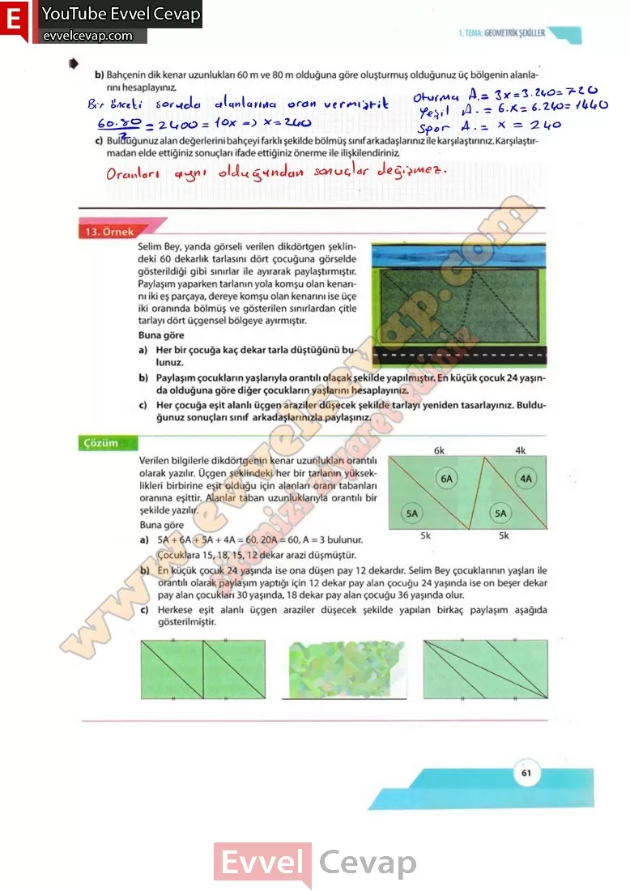

## 10. Sınıf Matematik Ders Kitabı Cevapları Meb Yayınları Sayfa 61

**Soru: b) Bahçenin dik kenar uzunlukları 60 m ve 80 m olduğuna göre oluşturmuş olduğunuz üç bölgenin alanlarını hesaplayınız**

**Soru: c) Bulduğunuz alan değerlerini bahçeyi farklı şekilde bölmüş sınıf arkadaşlarınız ile karşılaştırınız. Karşılaştırmadan elde ettiğiniz sonuçları ifade ettiğiniz önerme ile ilişkilendiriniz.**

Selim Bey, yanda görseli verilen dikdörtgen şeklindeki 60 dekarlık tarlasını dört çocuğuna görselde gösterildiği gibi sınırlar ile ayırarak paylaştırmıştır.  
 Paylaşım yaparken tarlanın yola komşu olan kenarını iki eş parçaya, dereye komşu olan kenarını ise üçe iki oranında bölmüş ve gösterilen sınırlardan çitle tarlayı dört üçgensel bölgeye ayırmıştır.  
 Buna göre  
 a) Her bir çocuğa kaç dekar tarla düştüğünü bulunuz.  
 b) Paylaşım çocukların yaşlarıyla orantılı olacak şekilde yapılmıştır. En küçük çocuk 24 yaşında olduğuna göre diğer çocukların yaşlarını hesaplayınız.  
 c) Her çocuğa eşit alanlı üçgen araziler düşecek şekilde tarlayı yeniden tasarlayınız. Bulduğunuz sonuçları sınıf arkadaşlarınızla paylaşınız.

Verilen bilgilerle dikdörtgenin kenar uzunlukları orantılı olarak yazılır. Üçgen şeklindeki her bir tarlanın yükseklikleri birbirine eşit olduğu için alanları oranı tabanları oranına eşittir. Alanlar taban uzunluklarıyla orantılı bir şekilde yazılır.  
 Buna göre  
 a) 5A + 6A + 5A + 4A – 60, 20A – 60, A = 3 bulunur.  
 Çocuklara 15,18,15,12 dekar arazi düşmüştür.  
 b) En küçük çocuk 24 yaşında ise ona düşen pay 12 dekardır. Selim Bey çocuklarının yaşları ile orantılı olarak paylaşım yaptığı için 12 dekar pay alan çocuğu 24 yaşında ise on beşer dekar pay alan çocukları 30 yaşında, 18 dekar pay alan çocuğu 36 yaşında olur.  
 c) Herkese eşit alanlı üçgen araziler düşecek şekilde yapılan birkaç paylaşım aşağıda gösterilmiştir.

**10. Sınıf Meb Yayınları Matematik Ders Kitabı Sayfa 61**