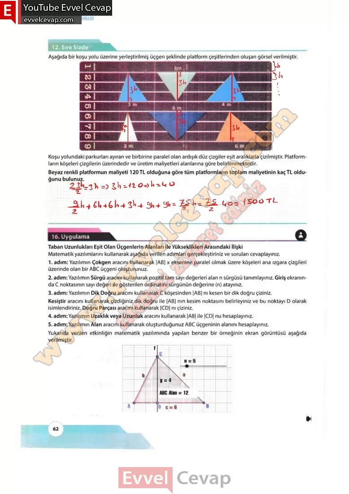

## 10. Sınıf Matematik Ders Kitabı Cevapları Meb Yayınları Sayfa 62

**12. Sıra Sizde**

**Soru: Aşağıda bir koşu yolu üzerine yerleştirilmiş üçgen şeklinde platform çeşitlerinden oluşan görsel verilmiştir. Koşu yolundaki parkurları ayıran ve birbirine paralel olan ardışık düz çizgiler eşit aralıklarla çizilmiştir. Platformların köşeleri çizgilerin üzerindedir ve üretim maliyetleri alanlarına göre belirlenmektedir. Beyaz renkli platformun maliyeti 120 TL olduğuna göre tüm platformların toplam maliyetinin kaç TL olduğunu bulunuz.**

**16. Uygulama**

**Taban Uzunlukları Eşit Olan Üçgenlerin Alanları ile Yükseklikleri Arasındaki İlişki**

**Soru: Matematik yazılımlarını kullanarak aşağıda verilen adımları gerçekleştiriniz ve soruları cevaplayınız.**

1. adım: Yazılımın Çokgen aracını kullanarak [AB] x eksenine paralel olmak üzere köşeleri ana ızgara çizgileri üzerinde olan bir ABC üçgeni oluşturunuz.  
 2. adım: Yazılımın Sürgü aracını kullanarak pozitif tam sayı değerleri alan n sürgüsü tanımlayınız. Giriş ekranında C noktasının sayı değeri ile gösterilen ordinatını sürgünün değerine (n) atayınız.  
 3. adım: Yazılımın Dik Doğru aracını kullanarak C köşesinden [AB] nı kesen bir dik doğru çiziniz. Kesiştir aracını kullanarak çizdiğiniz dik doğru ile [AB] nın kesim noktasını belirleyiniz ve bu noktayı D olarak isimlendiriniz. Doğru Parçası aracını kullanarak [CD] nı çiziniz.  
 4. adım: Yazılımın Uzaklık veya Uzunluk aracını kullanarak |AB| ile |CD| nu hesaplayınız.  
 5. adım: Yazılımın Alan aracını kullanarak oluşturduğunuz ABC üçgeninin alanını hesaplayınız.  
 Yukarıda verilen etkinliğin matematik yazılımında yapılan benzer bir örneğinin ekran görüntüsü aşağıda verilmiştir.

**10. Sınıf Meb Yayınları Matematik Ders Kitabı Sayfa 62**