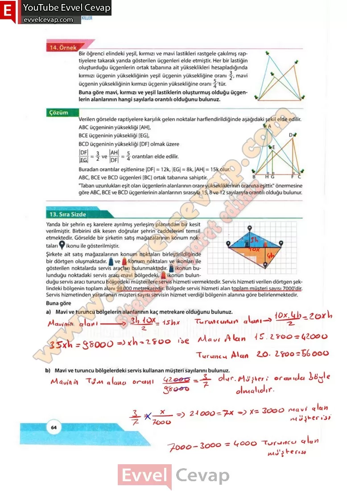

## 10. Sınıf Matematik Ders Kitabı Cevapları Meb Yayınları Sayfa 64

öğrenci elindeki yeşil, kırmızı ve mavi lastikleri rastgele çakılmış raptiyelere takarak yanda gösterilen üçgenleri elde etmiştir. Her bir lastiğin oluşturduğu üçgenlerin ortak tabanına ait yükseklikleri hesapladığında kırmızı üçgenin yüksekliğinin yeşil üçgenin yüksekliğine oranı Buna göre mavi, kırmızı ve yeşil lastiklerin oluşturmuş olduğu üçgenlerin alanlarının hangi sayılarla orantılı olduğunu bulunuz. Buradan orantılar eşitlenirse |DF| = 12k, |EG| = 8k, |AH| = 15k olur. ABC, BCE ve BCD üçgenleri [BC] ortak tabanına sahiptir. “Taban uzunlukları eşit olan üçgenlerin alanlarının oranı yüksekliklerinin oranına eşittir.” önermesine göre ABC, BCE ve BCD üçgenlerinin alanlarının sırasıyla 15,8 ve 12 sayılarıyla orantılı olduğu bulunur.

**13. Sıra Sizde**

**Soru: Mavi ve turuncu bölgelerin alanlarının kaç metrekare olduğunu bulunuz.**

**Soru: Mavi ve turuncu bölgelerdeki servis kullanan müşteri sayılarını bulunuz.**

**10. Sınıf Meb Yayınları Matematik Ders Kitabı Sayfa 64**