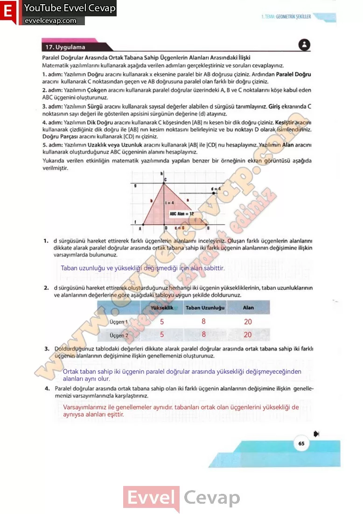

## 10. Sınıf Matematik Ders Kitabı Cevapları Meb Yayınları Sayfa 65

**Uygulama**

**Paralel Doğrular Arasında Ortak Tabana Sahip Üçgenlerin Alanları Arasındaki İlişki**

**Soru: Matematik yazılımlarını kullanarak aşağıda verilen adımları gerçekleştiriniz ve soruları cevaplayınız.**

1. adım: Yazılımın Doğru aracını kullanarak x eksenine paralel bir AB doğrusu çiziniz. Ardından Paralel Doğru aracını kullanarak C noktasından geçen ve AB doğrusuna paralel olan farklı bir doğru çiziniz.  
 2. adım: Yazılımın Çokgen aracını kullanarak paralel doğrular üzerindeki A, B ve C noktalarını köşe kabul eden  
 ABC üçgenini oluşturunuz.  
 3. adım: Yazılımın Sürgü aracını kullanarak sayısal değerler alabilen d sürgüsü tanımlayınız. Giriş ekranında C noktasının sayı değeri ile gösterilen apsisini sürgünün değerine (d) atayınız.  
 4. adım: Yazılımın Dik Doğru aracını kullanarak C köşesinden [AB] nı kesen bir dik doğru çiziniz. Kesiştir aracını kullanarak çizdiğiniz dik doğru ile [AB] nın kesim noktasını belirleyiniz ve bu noktayı D olarak isimlendiriniz. Doğru Parçası aracını kullanarak [CD] nı çiziniz.  
 5. adım: Yazılımın Uzaklık veya Uzunluk aracını kullanarak |AB| ile |CD| nu hesaplayınız. Yazılımın Alan aracını kullanarak oluşturduğunuz ABC üçgeninin alanını hesaplayınız.  
 Yukarıda verilen etkinliğin matematik yazılımında yapılan benzer bir örneğinin ekran görüntüsü aşağıda verilmiştir.

**Soru: 1) d sürgüsünü hareket ettirerek farklı üçgenlerin alanlarını inceleyiniz. Oluşan farklı üçgenlerin alanlarını dikkate alarak paralel doğrular arasında ortak tabana sahip iki farklı üçgenin alanlarının değişimine ilişkin varsayımlarda bulununuz.**

**Soru: 2) d sürgüsünü hareket ettirerek oluşturduğunuz herhangi iki üçgenin yüksekliklerinin, taban uzunluklarının ve alanlarının değerlerine göre aşağıdaki tabloyu uygun şekilde doldurunuz.**

**Soru: 3) Doldurduğunuz tablodaki değerleri dikkate alarak paralel doğrular arasında ortak tabana sahip iki farklı üçgenin alanlarının değişimine ilişkin genellemenizi oluşturunuz.**

**Soru: 4) Paralel doğrular arasında ortak tabana sahip olan iki farklı üçgenin alanlarının değişimine ilişkin genellemenizi varsayımlarınızla karşılaştırınız.**

**10. Sınıf Meb Yayınları Matematik Ders Kitabı Sayfa 65**