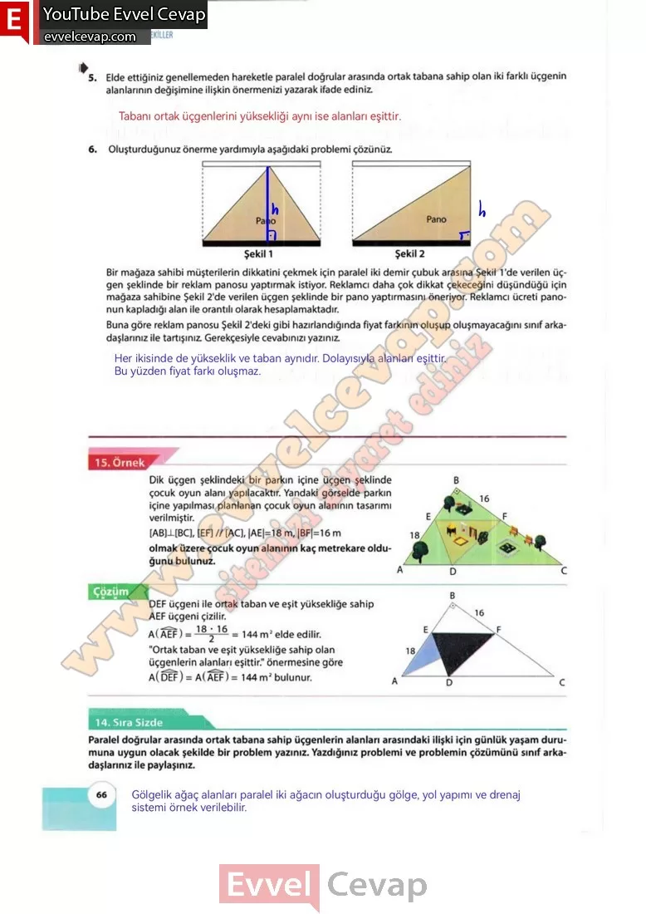

## 10. Sınıf Matematik Ders Kitabı Cevapları Meb Yayınları Sayfa 66

**Soru: 5) Elde ettiğiniz genellemeden hareketle paralel doğrular arasında ortak tabana sahip olan iki farklı üçgenin alanlarının değişimine ilişkin önermenizi yazarak ifade ediniz.**

**Soru: 6)** Oluşturduğunuz önerme yardımıyla aşağıdaki problemi çözünüz. Bir mağaza sahibi müşterilerin dikkatini çekmek için paralel iki demir çubuk arasına Şekil 1 ‘de verilen üçgen şeklinde bir reklam panosu yaptırmak istiyor. Reklamcı daha çok dikkat çekeceğini düşündüğü için mağaza sahibine Şekil 2’de verilen üçgen şeklinde bir pano yaptırmasını öneriyor. Reklamcı ücreti panonun kapladığı alan ile orantılı olarak hesaplamaktadır. **Buna göre reklam panosu Şekil 2’deki gibi hazırlandığında fiyat farkının oluşup oluşmayacağını sınıf arkadaşlarınız ile tartışınız. Gerekçesiyle cevabınızı yazınız.**

**14. Sıra Sizde**

**Soru: Paralel doğrular arasında ortak tabana sahip üçgenlerin alanları arasındaki ilişki için günlük yaşam durumuna uygun olacak şekilde bir problem yazınız. Yazdığınız problemi ve problemin çözümünü sınıf arkadaşlarınız ile paylaşınız.**

**10. Sınıf Meb Yayınları Matematik Ders Kitabı Sayfa 66**