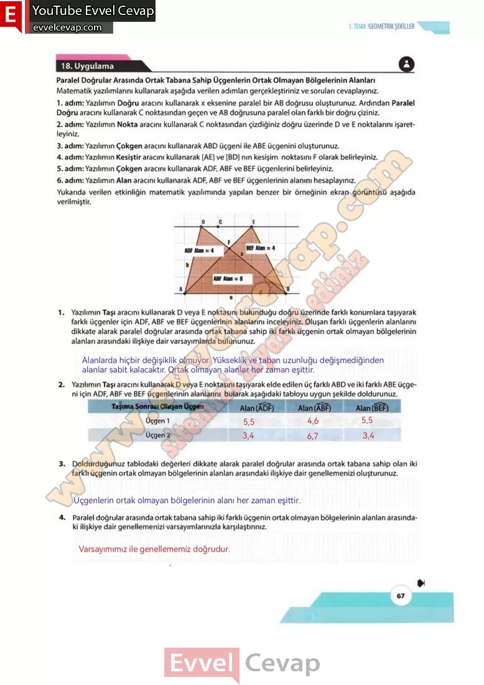

## 10. Sınıf Matematik Ders Kitabı Cevapları Meb Yayınları Sayfa 67

**18. Uygulama**

**Soru: Paralel Doğrular Arasında Ortak Tabana Sahip Üçgenlerin Ortak Olmayan Bölgelerinin Alanları**

Matematik yazılımlarını kullanarak aşağıda verilen adımları gerçekleştiriniz ve soruları cevaplayınız.  
 1. adım: Yazılımın Doğru aracını kullanarak x eksenine paralel bir AB doğrusu oluşturunuz. Ardından Paralel Doğru aracını kullanarak C noktasından geçen ve AB doğrusuna paralel olan farklı bir doğru çiziniz.  
 2. adım: Yazılımın Nokta aracını kullanarak C noktasından çizdiğiniz doğru üzerinde D ve E noktalarını işaretleyiniz.  
 3. adım: Yazılımın Çokgen aracını kullanarak ABD üçgeni ile ABE üçgenini oluşturunuz.  
 4. adım: Yazılımın Kesiştir aracını kullanarak [AE] ve [BD] nın kesişim noktasını F olarak belirleyiniz.  
 5. adım: Yazılımın Çokgen aracını kullanarak ADF, ABF ve BEF üçgenlerini belirleyiniz.  
 6. adım: Yazılımın Alan aracını kullanarak ADF, ABF ve BEF üçgenlerinin alanını hesaplayınız.  
 Yukarıda verilen etkinliğin matematik yazılımında yapılan benzer bir örneğinin ekran görüntüsü aşağıda verilmiştir.

**Soru: 1) Yazılımın Taşı aracını kullanarak D veya E noktasını bulunduğu doğru üzerinde farklı konumlara taşıyarak farklı üçgenler için ADF, ABF ve BEF üçgenlerinin alanlarını inceleyiniz. Oluşan farklı üçgenlerin alanlarını dikkate alarak paralel doğrular arasında ortak tabana sahip iki farklı üçgenin ortak olmayan bölgelerinin alanları arasındaki ilişkiye dair varsayımlarda bulununuz.**

**Soru: 2) Yazılımın Taşı aracını kullanarak D veya E noktasını taşıyarak elde edilen üç farklı ABD ve iki farklı ABE üçgeni için ADF, ABF ve BEF üçgenlerinin alanlarını bularak aşağıdaki tabloyu uygun şekilde doldurunuz.**

**Soru: 3) Doldurduğunuz tablodaki değerleri dikkate alarak paralel doğrular arasında ortak tabana sahip olan iki farklı üçgenin ortak olmayan bölgelerinin alanları arasındaki ilişkiye dair genellemenizi oluşturunuz.**

**Soru: 4) Paralel doğrular arasında ortak tabana sahip iki farklı üçgenin ortak olmayan bölgelerinin alanları arasındaki ilişkiye dair genellemenizi varsayımlarınızla karşılaştırınız.**

**10. Sınıf Meb Yayınları Matematik Ders Kitabı Sayfa 67**