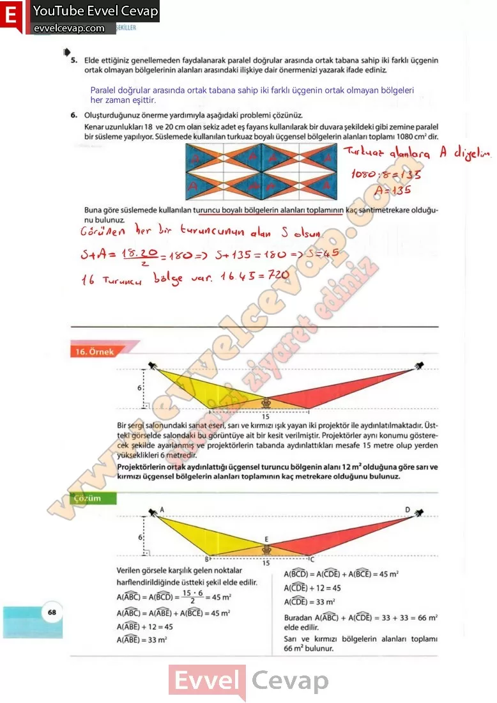

## 10. Sınıf Matematik Ders Kitabı Cevapları Meb Yayınları Sayfa 68

**Soru: 5) Elde ettiğiniz genellemeden faydalanarak paralel doğrular arasında ortak tabana sahip iki farklı üçgenin ortak olmayan bölgelerinin alanları arasındaki ilişkiye dair önermenizi yazarak ifade ediniz.**

**Soru: 6) Oluşturduğunuz önerme yardımıyla aşağıdaki problemi çözünüz. Kenar uzunlukları 18 ve 20 cm olan sekiz adet eş fayans kullanılarak bir duvara şekildeki gibi zemine paralel bir süsleme yapılıyor. Süslemede kullanılan turkuaz boyalı üçgensel bölgelerin alanları toplamı 1080 cm2 dir. Buna göre süslemede kullanılan turuncu boyalı bölgelerin alanları toplamının kaç santimetrekare olduğunu bulunuz.**

Bir sergi salonundaki sanat eseri, sarı ve kırmızı ışık yayan iki projektör ile aydınlatılmaktadır. Üstteki görselde salondaki bu görüntüye ait bir kesit verilmiştir. Projektörler aynı konumu gösterecek şekilde ayarlanmış ve projektörlerin tabanda aydınlattıkları mesafe 15 metre olup yerden  
 yükseklikleri 6 metredir. Projektörlerin ortak aydınlattığı üçgensel turuncu bölgenin alanı 12 m2 olduğuna göre sarı ve kırmızı üçgensel bölgelerin alanları toplamının kaç metrekare olduğunu bulunuz.

**10. Sınıf Meb Yayınları Matematik Ders Kitabı Sayfa 68**