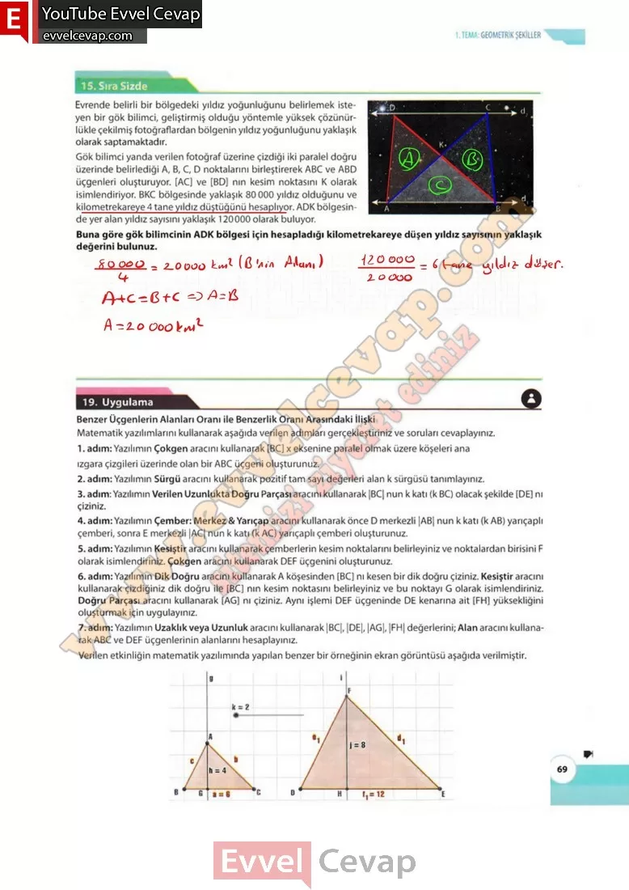

## 10. Sınıf Matematik Ders Kitabı Cevapları Meb Yayınları Sayfa 69

**Sıra Sizde**

Evrende belirli bir bölgedeki yıldız yoğunluğunu belirlemek isteyen bir gök bilimci, geliştirmiş olduğu yöntemle yüksek çözünürlükle çekilmiş fotoğraflardan bölgenin yıldız yoğunluğunu yaklaşık olarak saptamaktadır. Gök bilimci yanda verilen fotoğraf üzerine çizdiği iki paralel doğru üzerinde belirlediği A, B, C, D noktalarını birleştirerek ABC ve ABD üçgenleri oluşturuyor. [AC] ve [BD] nın kesim noktasını K olarak isimlendiriyor. BKC bölgesinde yaklaşık 80 000 yıldız olduğunu ve kilometrekareye 4 tane yıldız düştüğünü hesaplıyor. ADK bölgesinde yer alan yıldız sayısını yaklaşık 120000 olarak buluyor.

**Soru: Buna göre gök bilimcinin ADK bölgesi için hesapladığı kilometrekareye düşen yıldız sayısının yaklaşık değerini bulunuz.**

**19. Uygulama**

**Benzer Üçgenlerin Alanları Oranı ile Benzerlik Oranı Arasındaki İlişki**

**Soru: Matematik yazılımlarını kullanarak aşağıda verilen adımları gerçekleştiriniz ve soruları cevaplayınız.**

1. adım: Yazılımın Çokgen aracını kullanarak [BC] x eksenine paralel olmak üzere köşeleri ana ızgara çizgileri üzerinde olan bir ABC üçgeni oluşturunuz.  
 2. adım: Yazılımın Sürgü aracını kullanarak pozitif tam sayı değerleri alan k sürgüsü tanımlayınız.  
 3. adım: Yazılımın Verilen Uzunlukta Doğru Parçası aracını kullanarak |BC| nun k katı (k BC) olacak şekilde [DE] nı çiziniz.  
 4. adım: Yazılımın Çember: Merkez & Yarıçap aracını kullanarak önce D merkezli |AB| nun k katı (k AB) yarıçaplı çemberi, sonra E merkezli |AC| nun k katı (k AC) yarıçaplı çemberi oluşturunuz.  
 5. adım: Yazılımın Kesiştir aracını kullanarak çemberlerin kesim noktalarını belirleyiniz ve noktalardan birisini F olarak isimlendiriniz. Çokgen aracını kullanarak DEF üçgenini oluşturunuz.  
 6. adım: Yazılımın Dik Doğru aracını kullanarak A köşesinden [BC] nı kesen bir dik doğru çiziniz. Kesiştir aracını kullanarak çizdiğiniz dik doğru ile [BC] nın kesim noktasını belirleyiniz ve bu noktayı G olarak isimlendiriniz. Doğru Parçası aracını kullanarak [AG] nı çiziniz. Aynı işlemi DEF üçgeninde DE kenarına ait [FH] yüksekliğini oluşturmak için uygulayınız.  
 7. adım: Yazılımın Uzaklık veya Uzunluk aracını kullanarak |BC|, |DE|, |AG|, |FH| değerlerini; Alan aracını kullanarak ABC ve DEF üçgenlerinin alanlarını hesaplayınız.  
 Verilen etkinliğin matematik yazılımında yapılan benzer bir örneğinin ekran görüntüsü aşağıda verilmiştir.

**10. Sınıf Meb Yayınları Matematik Ders Kitabı Sayfa 69**