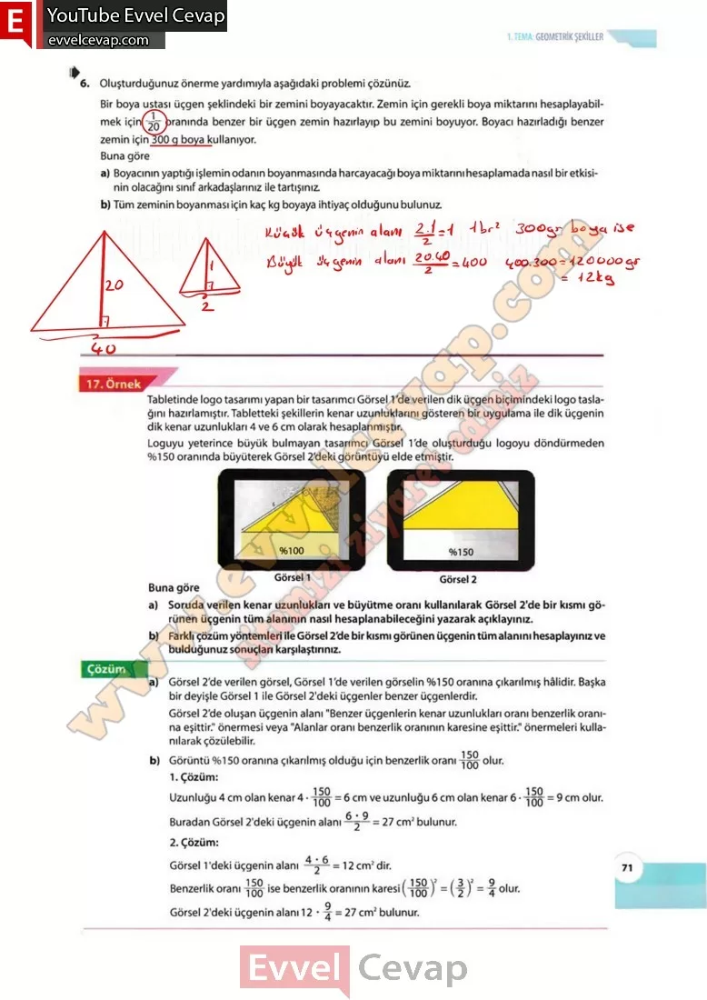

## 10. Sınıf Matematik Ders Kitabı Cevapları Meb Yayınları Sayfa 71

**Soru: 6) Oluşturduğunuz önerme yardımıyla aşağıdaki problemi çözünüz. Bir boya ustası üçgen şeklindeki bir zemini boyayacaktır. Zemin için gerekli boya miktarını hesaplayabilmek için 1/20 oranında benzer bir üçgen zemin hazırlayıp bu zemini boyuyor. Boyacı hazırladığı benzer zemin için 300 g boya kullanıyor. Buna göre**

**Soru: a) Boyacının yaptığı işlemin odanın boyanmasında harcayacağı boya miktarını hesaplamada nasıl bir etkisinin olacağını sınıf arkadaşlarınız ile tartışınız.**

**Soru: b) Tüm zeminin boyanması için kaç kg boyaya ihtiyaç olduğunu bulunuz.**

Tabletinde logo tasarımı yapan bir tasarımcı Görsel 1’de verilen dik üçgen biçimindeki logo taslağını hazırlamıştır. Tabletteki şekillerin kenar uzunluklarını gösteren bir uygulama ile dik üçgenin dik kenar uzunlukları 4 ve 6 cm olarak hesaplanmıştır.  
 Loguyu yeterince büyük bulmayan tasarımcı Görsel Vde oluşturduğu logoyu döndürmeden %150 oranında büyüterek Görsel 2’deki görüntüyü elde etmiştir.

Buna göre  
 a) Soruda verilen kenar uzunlukları ve büyütme oranı kullanılarak Görsel 2’de bir kısmı görünen üçgenin tüm alanının nasıl hesaplanabileceğini yazarak açıklayınız.  
 b) Farklı çözüm yöntemleri ile Görsel 2’de bir kısmı görünen üçgenin tüm alanını hesaplayınız ve bulduğunuz sonuçları karşılaştırınız.

Görsel 2’de verilen görsel, Görsel 1 ‘de verilen görselin %150 oranına çıkarılmış hâlidir. Başka bir deyişle Görsel 1 ile Görsel 2’deki üçgenler benzer üçgenlerdir.  
 Görsel 2’de oluşan üçgenin alanı “Benzer üçgenlerin kenar uzunlukları oranı benzerlik oranına eşittir.” önermesi veya “Alanlar oranı benzerlik oranının karesine eşittir.” önermeleri kullanılarak çözülebilir.

**10. Sınıf Meb Yayınları Matematik Ders Kitabı Sayfa 71**