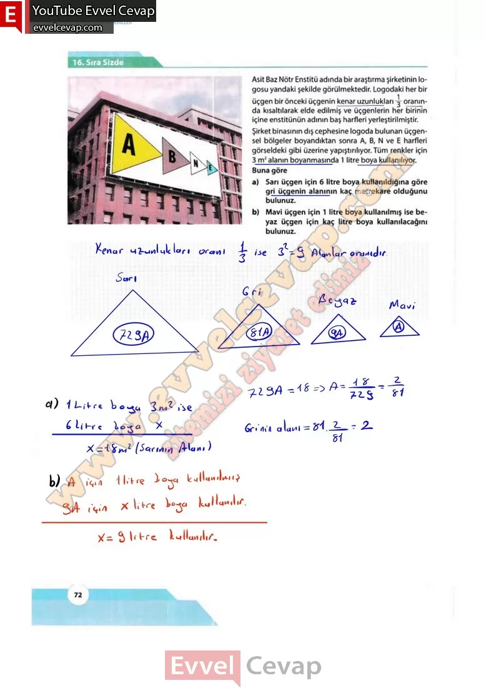
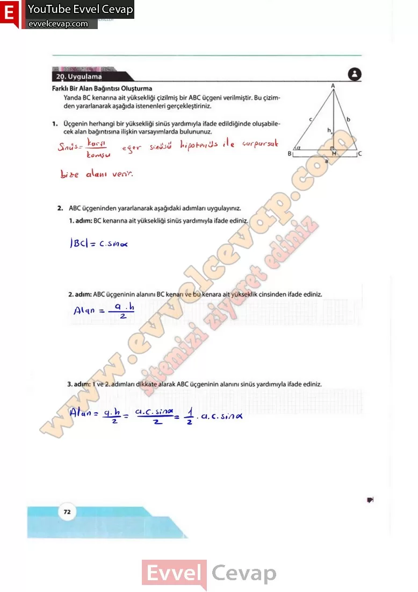

## 10. Sınıf Matematik Ders Kitabı Cevapları Meb Yayınları Sayfa 72

**Sıra Sizde**

**Soru: Asit Baz Nötr Enstitü adında bir araştırma şirketinin logosu yandaki şekilde görülmektedir. Logodaki her bir üçgen bir önceki üçgenin kenar uzunlukları 1/3 oranında kısaltılarak elde edilmiş ve üçgenlerin her birinin içine enstitünün adının baş harfleri yerleştirilmiştir. Şirket binasının dış cephesine logoda bulunan üçgen- sel bölgeler boyandıktan sonra A, B, N ve E harfleri görseldeki gibi üzerine yapıştırılıyor. Tüm renkler için 3 m2 alanın boyanmasında 1 litre boya kullanılıyor. Buna göre**

**Soru: a) Sarı üçgen için 6 litre boya kullanıldığına göre gri üçgenin alanının kaç metrekare olduğunu bulunuz.**

**Soru: b) Mavi üçgen için 1 litre boya kullanılmış ise beyaz üçgen için kaç litre boya kullanılacağını bulunuz.**

**20. Uygulama**

**Farklı Bir Alan Bağıntısı Oluşturma**

**Soru: Yanda BC kenarına ait yüksekliği çizilmiş bir ABC üçgeni verilmiştir. Bu çizimden yararlanarak aşağıda istenenleri gerçekleştiriniz.**

**Soru: 1) Üçgenin herhangi bir yüksekliği sinüs yardımıyla ifade edildiğinde oluşabilecek alan bağıntısına ilişkin varsayımlarda bulununuz.**

**Soru: 2) ABC üçgeninden yararlanarak aşağıdaki adımları uygulayınız.**

**Soru: BC kenarına ait yüksekliği sinüs yardımıyla ifade ediniz.**

**Soru: ABC üçgeninin alanını BC kenarı ve bu kenara ait yükseklik cinsinden ifade ediniz.**

**Soru: 1 ve 2. adımları dikkate alarak ABC üçgeninin alanını sinüs yardımıyla ifade ediniz.**

  
 

**10. Sınıf Meb Yayınları Matematik Ders Kitabı Sayfa 72**