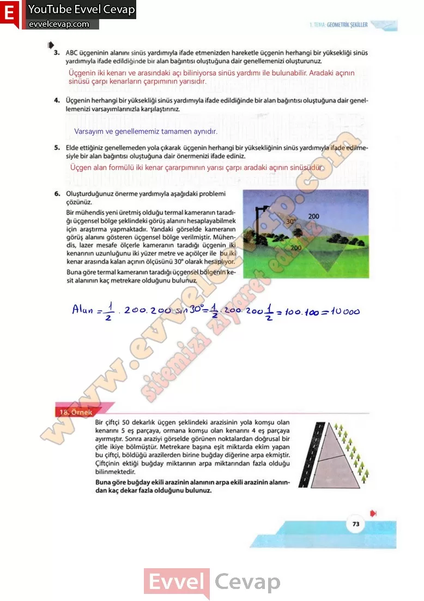

## 10. Sınıf Matematik Ders Kitabı Cevapları Meb Yayınları Sayfa 73

**Soru: 3) ABC üçgeninin alanını sinüs yardımıyla ifade etmenizden hareketle üçgenin herhangi bir yüksekliği sinüs yardımıyla ifade edildiğinde bir alan bağıntısı oluştuğuna dair genellemenizi oluşturunuz.**

**Soru: 4) Üçgenin herhangi bir yüksekliği sinüs yardımıyla ifade edildiğinde bir alan bağıntısı oluştuğuna dair genellemenizi varsayımlarınızla karşılaştırınız.**

**Soru: 5) Elde ettiğiniz genellemeden yola çıkarak üçgenin herhangi bir yüksekliğinin sinüs yardımıyla ifade edilmesiyle bir alan bağıntısı oluştuğuna dair önermenizi ifade ediniz.**

**Soru: 6)** Oluşturduğunuz önerme yardımıyla aşağıdaki problemi çözünüz. Bir mühendis yeni üretmiş olduğu termal kameranın taradığı üçgensel bölge şeklindeki görüş alanını hesaplayabilmek için araştırma yapmaktadır. **Yandaki görselde kameranın görüş alanını gösteren üçgensel bölge verilmiştir. Mühendis, lazer mesafe ölçerle kameranın taradığı üçgenin iki kenarının uzunluğunu iki yüzer metre ve açıölçer ile bu iki kenar arasında kalan açının ölçüsünü 30° olarak hesaplıyor. Buna göre termal kameranın taradığı üçgensel bölgenin kesit alanının kaç metrekare olduğunu bulunuz.**

Bir çiftçi 50 dekarlık üçgen şeklindeki arazisinin yola komşu olan kenarını 5 eş parçaya, ormana komşu olan kenarını 4 eş parçaya ayırmıştır. Sonra araziyi görselde görünen noktalardan doğrusal bir çitle ikiye bölmüştür. Metrekare başına eşit miktarda ekim yapan bu çiftçi, böldüğü arazilerden birine buğday diğerine arpa ekmiştir. Çiftçinin ektiği buğday miktarının arpa miktarından fazla olduğu bilinmektedir. Buna göre buğday ekili arazinin alanının arpa ekili arazinin alanından kaç dekar fazla olduğunu bulunuz.

**10. Sınıf Meb Yayınları Matematik Ders Kitabı Sayfa 73**