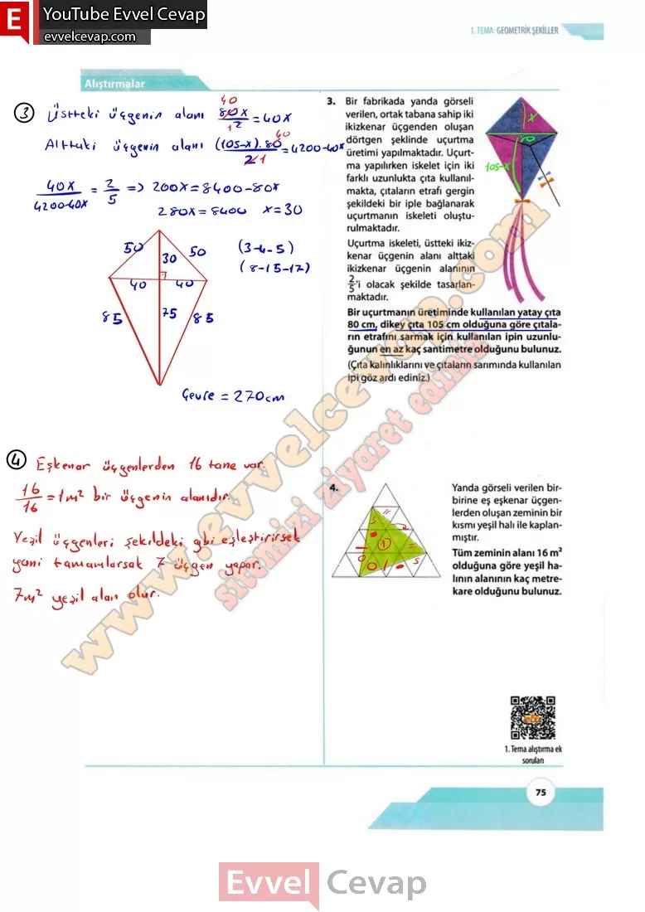

## 10. Sınıf Matematik Ders Kitabı Cevapları Meb Yayınları Sayfa 75

**Soru: 1)** Aşağıda verilen dikdörtgen şeklindeki tente, doğrusal iki eş parçadan oluşan metal mekanizmanın hareketi ile açılıp kapanmaktadır.**Eni 6 metre olan tente, Şekil 1’den Şekil 2’deki konuma getirildiğinde tentenin oluşturduğu mavi dikdörtgenin alanı Şekil 2’deki konumunda Şekil 1 ‘deki konumuna göre iki katına çıkmıştır. Her iki konumda da metal mekanizmaların oluşturduğu ABC ve DBE üçgenlerinin alanları birbirine eşit olduğuna göre Şekil 2’de D noktasının tentenin sol kenarına olan en kısa uzaklığı- nın kaç metre olduğunu bulunuz.**

**Soru: 2) Aşağıda ön yüzü yeşil, arka yüzü mavi renkte dik üçgen şeklindeki bir karton Şekil 1’de gösterildiği gibi bir köşesi diğer kenar üzerine gelecek şekilde katlanarak Şekil 2’deki görsel elde ediliyor. Şekil 1’de verilen üçgenin dik kenar uzunlukları 12 ve 15 cm olduğuna göre Şekil 2’de yeşil üçgenin görünen kısmının alanının kaç santimet- rekare olduğunu bulunuz.**

**Soru: 3)** Bir fabrikada yanda görseli verilen, ortak tabana sahip iki ikizkenar üçgenden oluşan dörtgen şeklinde uçurtma üretimi yapılmaktadır. Uçurtma yapılırken iskelet için iki farklı uzunlukta çıta kullanılmakta, çıtaların etrafı gergin şekildeki bir iple bağlanarak uçurtmanın iskeleti oluşturulmaktadır. Uçurtma iskeleti, üstteki ikizkenar üçgenin alanı alttaki ikizkenar üçgenin alanının olacak şekilde tasarlanmaktadır. **Bir uçurtmanın üretiminde kullanılan yatay çıta 80 cm, dikey çıta 105 cm olduğuna göre çıtaların etrafını sarmak için kullanılan ipin uzunluğunun en az kaç santimetre olduğunu bulunuz. (Çıta kalınlıklarını ve çıtaların sarımında kullanılan ipi göz ardı ediniz.)**

**Soru: 4) Yanda görseli verilen birbirine eş eşkenar üçgenlerden oluşan zeminin bir kısmı yeşil halı ile kaplanmıştır. Tüm zeminin alanı 16 m2 olduğuna göre yeşil halının alanının kaç metrekare olduğunu bulunuz.**

  
 

**10. Sınıf Meb Yayınları Matematik Ders Kitabı Sayfa 75**