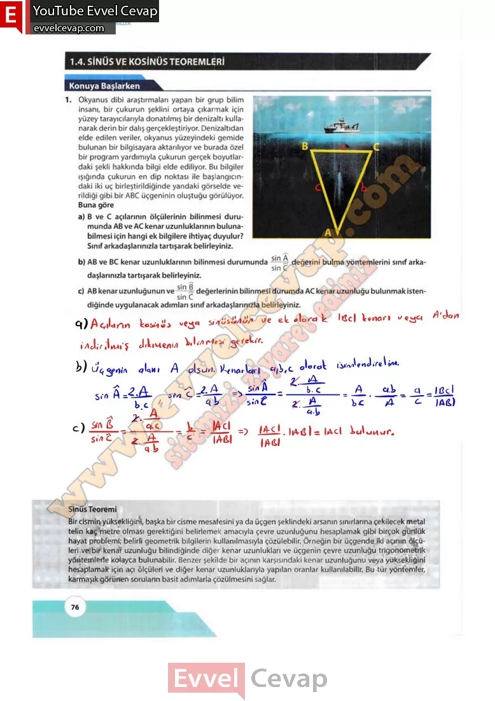
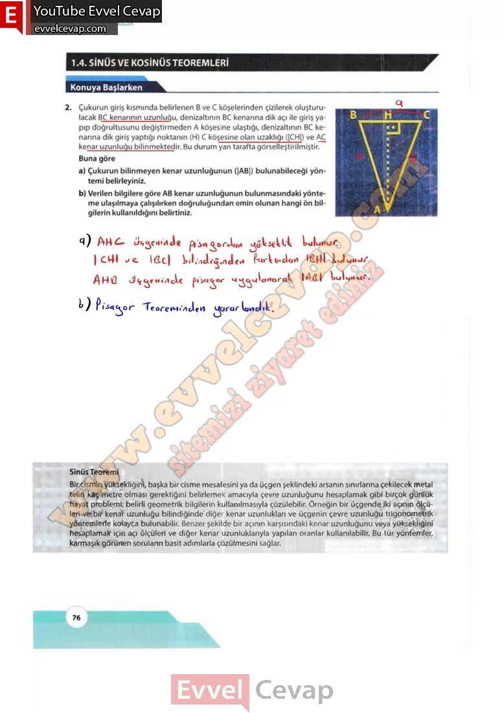

## 10. Sınıf Matematik Ders Kitabı Cevapları Meb Yayınları Sayfa 76

**Konuya Başlarken**

**Soru: 1) Okyanus dibi araştırmaları yapan bir grup bilim insanı, bir çukurun şeklini ortaya çıkarmak için yüzey tarayıcılarıyla donatılmış bir denizaltı kullanarak derin bir dalış gerçekleştiriyor. Denizaltıdan elde edilen veriler, okyanus yüzeyindeki gemide bulunan bir bilgisayara aktarılıyor ve burada özel bir program yardımıyla çukurun gerçek boyutlardaki şekli hakkında bilgi elde ediliyor. Bu bilgiler ışığında çukurun en dip noktası ile başlangıcındaki iki uç birleştirildiğinde yandaki görselde verildiği gibi bir ABC üçgeninin oluştuğu görülüyor. Buna göre**

**Soru: a) B ve C açılarının ölçülerinin bilinmesi durumunda AB ve AC kenar uzunluklarının bulunabilmesi için hangi ek bilgilere ihtiyaç duyulur? Sınıf arkadaşlarınızla tartışarak belirleyiniz.**

**Soru: b) AB ve BC kenar uzunluklarının bilinmesi durumunda değerini bulma yöntemlerini sınıf arkadaşlarınızla tartışarak belirleyiniz.**

**Soru: c) AB kenar uzunluğunun ve değerlerinin bilinmesi durumda AC kenar uzunluğu bulunmak istendiğinde uygulanacak adımları sınıf arkadaşlarınızla belirleyiniz.**

**Soru: 2) Çukurun giriş kısmında belirlenen B ve C köşelerinden çizilerek oluşturulacak BC kenarının uzunluğu, denizaltının BC kenarına dik açı ile giriş yapıp doğrultusunu değiştirmeden A köşesine ulaştığı, denizaltının BC kenarına dik giriş yaptığı noktanın (H) C köşesine olan uzaklığı (|CH|) ve AC kenar uzunluğu bilinmektedir. Bu durum yan tarafta görselleştirilmiştir. Buna göre**

**Soru: a) Çukurun bilinmeyen kenar uzunluğunun (|AB|) bulunabileceği yöntemi belirleyiniz.**

**Soru: b) Verilen bilgilere göre AB kenar uzunluğunun bulunmasındaki yönteme ulaşılmaya çalışılırken doğruluğundan emin olunan hangi ön bilgilerin kullanıldığını belirtiniz.**

**Sinüs Teoremi**

Bir cismin yüksekliğini, başka bir cisme mesafesini ya da üçgen şeklindeki arsanın sınırlarına çekilecek metal telin kaç metre olması gerektiğini belirlemek amacıyla çevre uzunluğunu hesaplamak gibi birçok günlük hayat problemi; belirli geometrik bilgilerin kullanılmasıyla çözülebilir. Örneğin bir üçgende iki açının ölçüleri ve bir kenar uzunluğu bilindiğinde diğer kenar uzunlukları ve üçgenin çevre uzunluğu trigonometrik yöntemlerle kolayca bulunabilir. Benzer şekilde bir açının karşısındaki kenar uzunluğunu veya yüksekliğini hesaplamak için açı ölçüleri ve diğer kenar uzunluklarıyla yapılan oranlar kullanılabilir. Bu tür yöntemler, karmaşık görünen soruların basit adımlarla çözülmesini sağlar.

  
 

**10. Sınıf Meb Yayınları Matematik Ders Kitabı Sayfa 76**