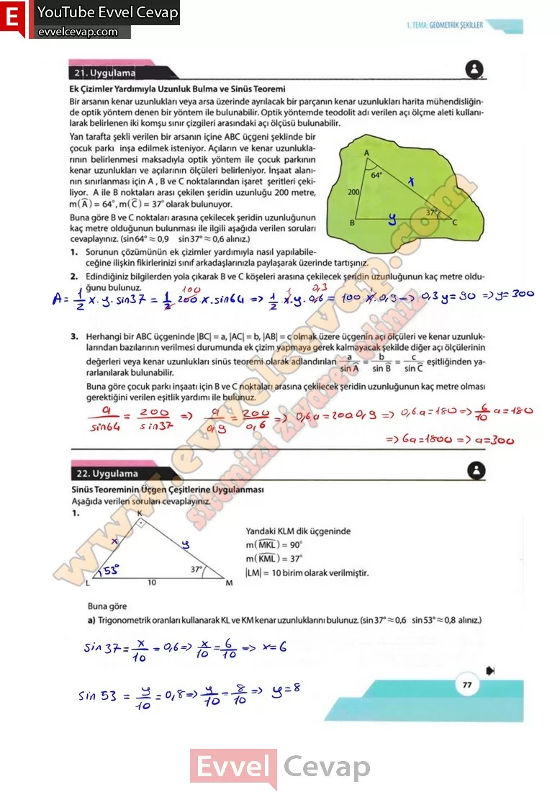

## 10. Sınıf Matematik Ders Kitabı Cevapları Meb Yayınları Sayfa 77

**21. Uygulama**

**Ek Çizimler Yardımıyla Uzunluk Bulma ve Sinüs Teoremi**

Bir arsanın kenar uzunlukları veya arsa üzerinde ayrılacak bir parçanın kenar uzunlukları harita mühendisliğinde optik yöntem denen bir yöntem ile bulunabilir. Optik yöntemde teodolit adı verilen açı ölçme aleti kullanılarak belirlenen iki komşu sınır çizgileri arasındaki açı ölçüsü bulunabilir. Yan tarafta şekli verilen bir arsanın içine ABC üçgeni şeklinde bir çocuk parkı inşa edilmek isteniyor. Açıların ve kenar uzunluklarının belirlenmesi maksadıyla optik yöntem ile çocuk parkının kenar uzunlukları ve açılarının ölçüleri belirleniyor. İnşaat alanının sınırlanması için A, B ve C noktalarından işaret şeritleri çekiliyor. A ile B noktaları arası çekilen şeridin uzunluğu 200 metre, m(A) = 64°, m(C) = 37° olarak bulunuyor.

**Soru: Buna göre B ve C noktaları arasına çekilecek şeridin uzunluğunun kaç metre olduğunun bulunması ile ilgili aşağıda verilen soruları cevaplayınız, (sin 64° % 0,9 sin 37° ~ 0,6 alınız.)**

**Soru: 1) Sorunun çözümünün ek çizimler yardımıyla nasıl yapılabileceğine ilişkin fikirlerinizi sınıf arkadaşlarınızla paylaşarak üzerinde tartışınız.**

**Soru: 2) Edindiğiniz bilgilerden yola çıkarak B ve C köşeleri arasına çekilecek şeridin uzunluğunun kaç metre olduğunu bulunuz.**

**Soru: 3) Herhangi bir ABC üçgeninde |BC| = a, |AC| = b, |AB| = c olmak üzere üçgenin açı ölçüleri ve kenar uzunluklarından bazılarının verilmesi durumunda ek çizim yapmaya gerek kalmayacak şekilde diğer açı ölçülerinin değerleri veya kenar uzunlukları sinüs teoremi olarak adlandırılan eşitliğinden yararlanılarak bulunabilir. Buna göre çocuk parkı inşaatı için B ve C noktaları arasına çekilecek şeridin uzunluğunun kaç metre olması gerektiğini verilen eşitlik yardımı ile bulunuz.**

**22. Uygulama**

**Sinüs Teoreminin Üçgen Çeşitlerine Uygulanması**

**Soru: 1) Aşağıda verilen soruları cevaplayınız. Yandaki KLM dik üçgeninde m(MKL) = 90° m(KML) = 37° |LM|= 10 birim olarak verilmiştir. Buna göre**

**Soru: a) Trigonometrik oranları kullanarak KL ve KM kenar uzunluklarını bulunuz.(sin37°~0,6 sin 53° ~ 0,8 alınız.)**

**10. Sınıf Meb Yayınları Matematik Ders Kitabı Sayfa 77**