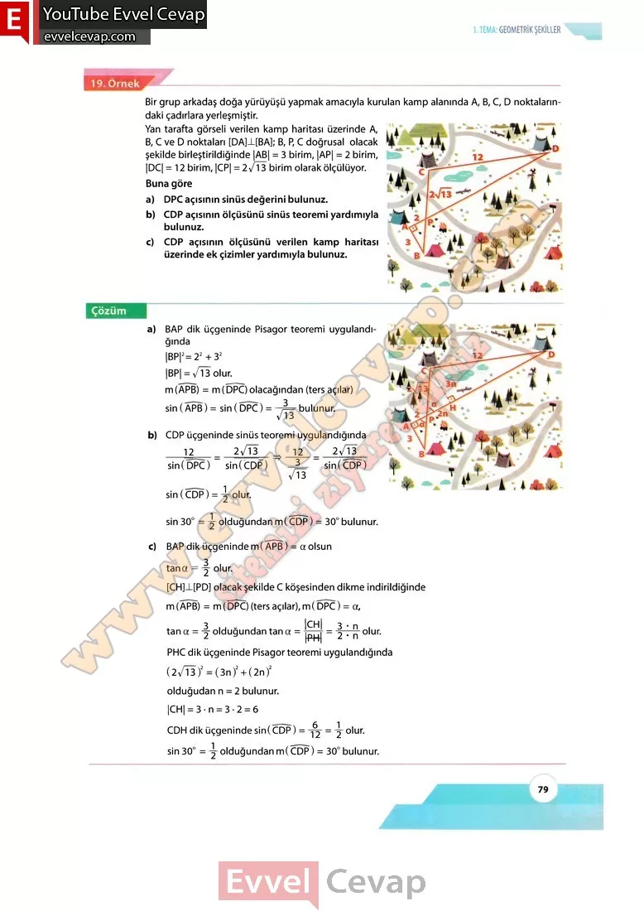

## 10. Sınıf Matematik Ders Kitabı Cevapları Meb Yayınları Sayfa 79

Bir grup arkadaş doğa yürüyüşü yapmak amacıyla kurulan kamp alanında A, B, C, D noktalarındaki çadırlara yerleşmiştir.  
 Yan tarafta görseli verilen kamp haritası üzerinde A, B, C ve D noktaları [DA]\_L[BA]; B, P, C doğrusal olacak şekilde birleştirildiğinde |AB| = 3 birim, |AP| = 2 birim, |DC| = 12 birim, |CP| =2/î~3 birim olarak ölçülüyor. Buna göre  
 a) DPC açısının sinüs değerini bulunuz.  
 b) CDP açısının ölçüsünü sinüs teoremi yardımıyla bulunuz.  
 c) CDP açısının ölçüsünü verilen kamp haritası üzerinde ek çizimler yardımıyla bulunuz.

* **Cevap**: **Bu sayfada soru bulunmamaktadır.**

**10. Sınıf Meb Yayınları Matematik Ders Kitabı Sayfa 79**