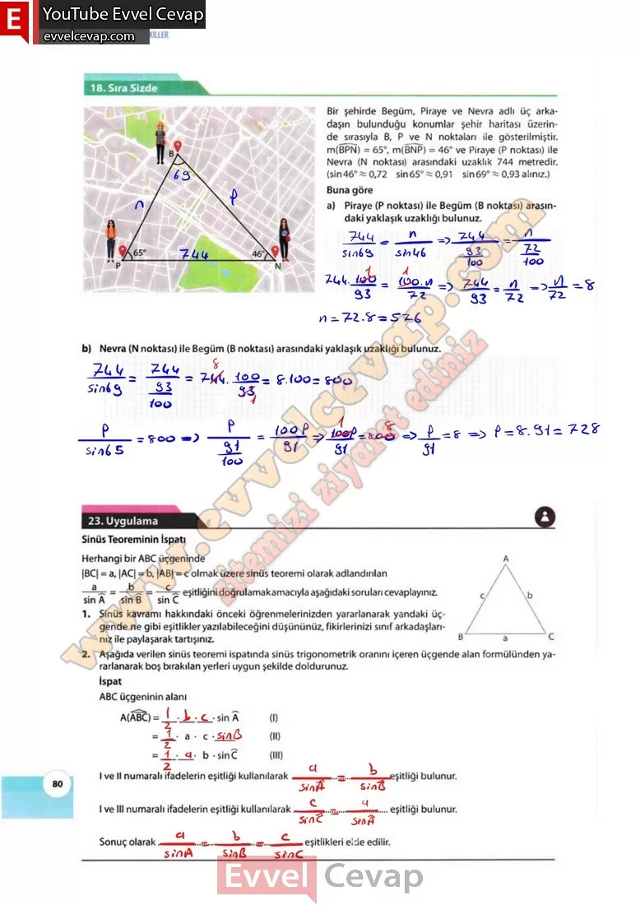

## 10. Sınıf Matematik Ders Kitabı Cevapları Meb Yayınları Sayfa 80

**18. Sıra Sizde**

**Soru: Bir şehirde Begüm, Piraye ve Nevra adlı üç arkadaşın bulunduğu konumlar şehir haritası üzerinde sırasıyla B, P ve N noktaları ile gösterilmiştir. m(BPN) = 65°, m(BNP) = 46° ve Piraye (P noktası) ile Nevra (N noktası) arasındaki uzaklık 744 metredir, (sin46° ~ 0,72 sin65° % 0,91 sin69° ~ 0,93 alınız.) Buna göre**

**Soru: a) Piraye (P noktası) ile Begüm (B noktası) arasındaki yaklaşık uzaklığı bulunuz.**

**Soru: b) Nevra (N noktası) ile Begüm (B noktası) arasındaki yaklaşık uzaklığı bulunuz.**

**23. Uygulama**

**Soru: Herhangi bir ABC üçgeninde |BC| = a, |AC| = b, |AB| = c olmak üzere sinüs teoremi olarak adlandırılan eşitliğini doğrulamak amacıyla aşağıdaki soruları cevaplayınız.**

**Soru: 1) Sinüs kavramı hakkındaki önceki öğrenmelerinizden yararlanarak yandaki üçgende ne gibi eşitlikler yazılabileceğini düşününüz, fikirlerinizi sınıf arkadaşlarınız ile paylaşarak tartışınız.**

**Soru: 2) Aşağıda verilen sinüs teoremi ispatında sinüs trigonometrik oranını içeren üçgende alan formülünden yararlanarak boş bırakılan yerleri uygun şekilde doldurunuz.**

I ve II numaralı ifadelerin eşitliği kullanılarak…eşitliği bulunur.  
 I ve III numaralı ifadelerin eşitliği kullanılarak…eşitliği bulunur.  
 Sonuç olarak…eşitlikleri elde edilir.

**10. Sınıf Meb Yayınları Matematik Ders Kitabı Sayfa 80**