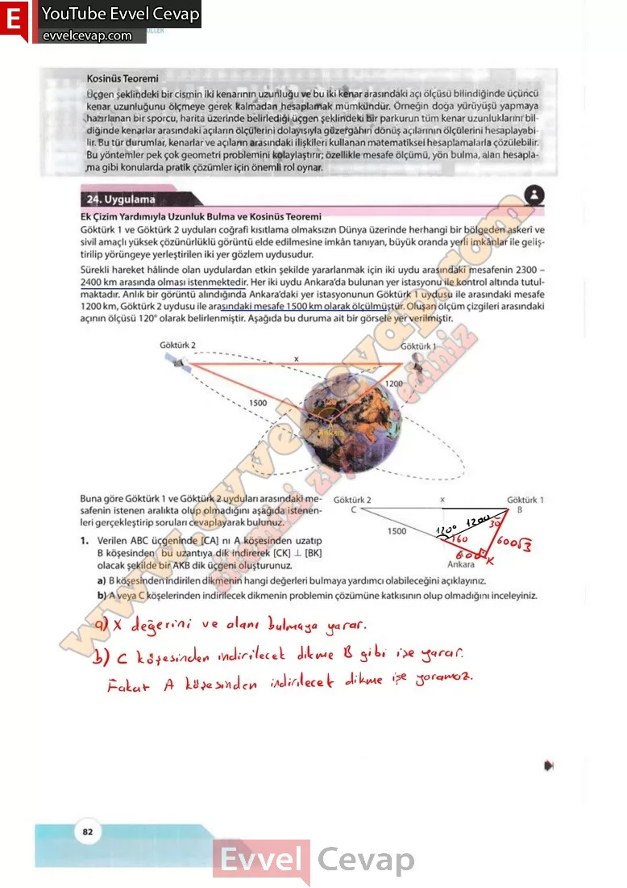
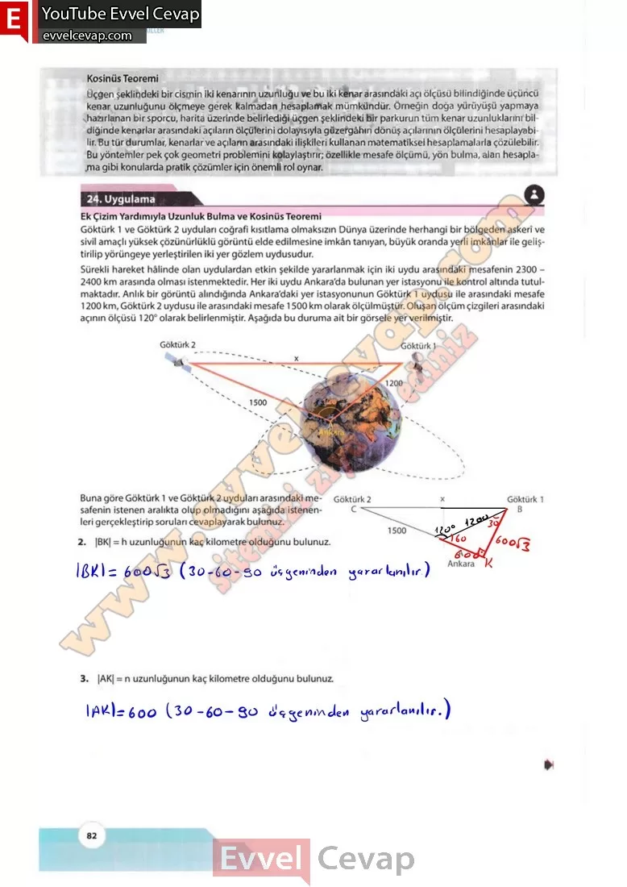

## 10. Sınıf Matematik Ders Kitabı Cevapları Meb Yayınları Sayfa 82

**Kosinüs Teoremi**  
 Üçgen şeklindeki bir cismin iki kenarının uzunluğu ve bu iki kenar arasındaki açı ölçüsü bilindiğinde üçüncü kenar uzunluğunu ölçmeye gerek kalmadan hesaplamak mümkündür. Örneğin doğa yürüyüşü yapmaya hazırlanan bir sporcu, harita üzerinde belirlediği üçgen şeklindeki bir parkurun tüm kenar uzunluklarını bildiğinde kenarlar arasındaki açıların ölçülerini dolayısıyla güzergâhın dönüş açılarının ölçülerini hesaplayabilir. Bu tür durumlar, kenarlar ve açıların arasındaki ilişkileri kullanan matematiksel hesaplamalarla çözülebilir. Bu yöntemler pek çok geometri problemini kolaylaştırır; özellikle mesafe ölçümü, yön bulma, alan hesaplama gibi konularda pratik çözümler için önemli rol oynar.

**24. Uygulama**

**Ek Çizim Yardımıyla Uzunluk Bulma ve Kosinüs Teoremi**

Göktürk 1 ve Göktürk 2 uyduları coğrafi kısıtlama olmaksızın Dünya üzerinde herhangi bir bölgeden askerî ve sivil amaçlı yüksek çözünürlüklü görüntü elde edilmesine imkân tanıyan, büyük oranda yerli imkânlar ile geliştirilip yörüngeye yerleştirilen iki yer gözlem uydusudur. Sürekli hareket hâlinde olan uydulardan etkin şekilde yararlanmak için iki uydu arasındaki mesafenin 2300 – 2400 km arasında olması istenmektedir. Her iki uydu Ankara’da bulunan yer istasyonu ile kontrol altında tutulmaktadır. Anlık bir görüntü alındığında Ankara’daki yer istasyonunun Göktürk 1 uydusu ile arasındaki mesafe 1200 km, Göktürk 2 uydusu ile arasındaki mesafe 1500 km olarak ölçülmüştür. Oluşan ölçüm çizgileri arasındaki açının ölçüsü 120° olarak belirlenmiştir. Aşağıda bu duruma ait bir görsele yer verilmiştir.

**Soru: Buna göre Göktürk 1 ve Göktürk 2 uyduları arasındaki mesafenin istenen aralıkta olup olmadığını aşağıda istenenleri gerçekleştirip soruları cevaplayarak bulunuz.**

**Soru: 1) Verilen ABC üçgeninde [CA] nı A köşesinden uzatıp B köşesinden bu uzantıya dik indirerek [CK]  [BK] olacak şekilde bir AKB dik üçgeni oluşturunuz.**

**Soru: a) B köşesinden indirilen dikmenin hangi değerleri bulmaya yardımcı olabileceğini açıklayınız.**

**Soru: b) A veya C köşelerinden indirilecek dikmenin problemin çözümüne katkısının olup olmadığını inceleyiniz.**

**Soru: 2) |BK| = h uzunluğunun kaç kilometre olduğunu bulunuz.**

**Soru: 3) |AK| = n uzunluğunun kaç kilometre olduğunu bulunuz.**

  
 

**10. Sınıf Meb Yayınları Matematik Ders Kitabı Sayfa 82**