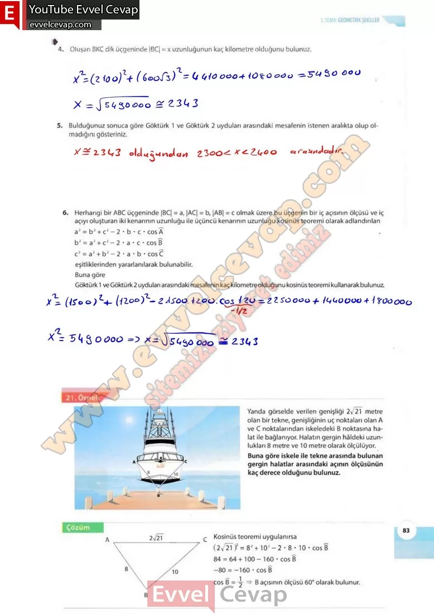

## 10. Sınıf Matematik Ders Kitabı Cevapları Meb Yayınları Sayfa 83

**Soru: 4) Oluşan BKC dik üçgeninde |BC| = x uzunluğunun kaç kilometre olduğunu bulunuz.**

**Soru: 5) Bulduğunuz sonuca göre Göktürk 1 ve Göktürk 2 uyduları arasındaki mesafenin istenen aralıkta olup olmadığını gösteriniz**

**Soru: 6)** Herhangi bir ABC üçgeninde |BC| = a, |AC| = b, |AB| = c olmak üzere bu üçgenin bir iç açısının ölçüsü ve iç açıyı oluşturan iki kenarının uzunluğu ile üçüncü kenarının uzunluğu kosinüs teoremi olarak adlandırılan a2 = b2 + c2 – 2 • b • c • cos A b2 = a2 + c2- 2 • a • c • cos B c2 = a2 + b2 – 2 • a • b • cos C eşitliklerinden yararlanılarak bulunabilir. **Buna göre Göktürk 1 ve Göktürk 2 uyduları arasındaki mesafenin kaç kilometre olduğunu kosinüs teoremi kullanarak bulunuz.**

Yanda görselde verilen genişliği 2/2T metre olan bir tekne, genişliğinin uç noktaları olan A ve C noktalarından iskeledeki B noktasına halat ile bağlanıyor. Halatın gergin hâldeki uzunlukları 8 metre ve 10 metre olarak ölçülüyor. gergin halatlar arasındaki açının ölçüsünün kaç derece olduğunu bulunuz.

**10. Sınıf Meb Yayınları Matematik Ders Kitabı Sayfa 83**