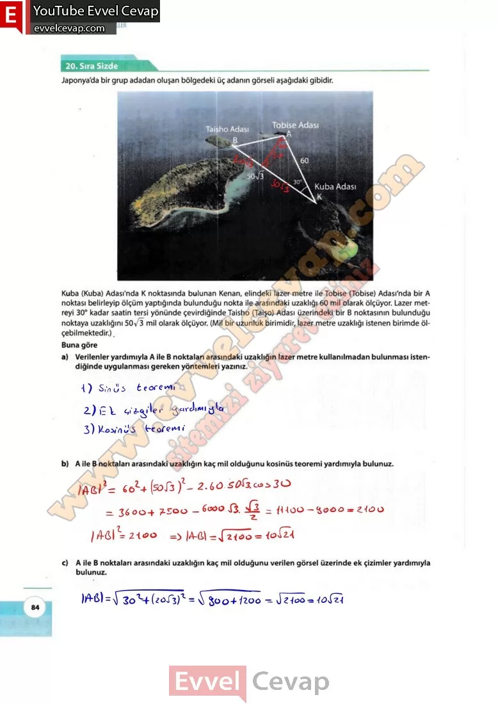

## 10. Sınıf Matematik Ders Kitabı Cevapları Meb Yayınları Sayfa 84

**20. Sıra Sizde**

**Soru: Küba (Küba) Adası’nda K noktasında bulunan Kenan, elindeki lazer metre ile Tobise (Tobise) Adası’nda bir A noktası belirleyip ölçüm yaptığında bulunduğu nokta ile arasındaki uzaklığı 60 mil olarak ölçüyor. Lazer metreyi 30° kadar saatin tersi yönünde çevirdiğinde Taisho (Taişo) Adası üzerindeki bir B noktasının bulunduğu noktaya uzaklığını 50✓3 mil olarak ölçüyor. (Mil bir uzunluk birimidir, lazer metre uzaklığı istenen birimde ölçebilmektedir.) . Buna göre**

**Soru: a) Verilenler yardımıyla A ile B noktaları arasındaki uzaklığın lazer metre kullanılmadan bulunması istendiğinde uygulanması gereken yöntemleri yazınız.**

**Soru: b) A ile B noktaları arasındaki uzaklığın kaç mil olduğunu kosinüs teoremi yardımıyla bulunuz.**

**Soru: c) A ile B noktaları arasındaki uzaklığın kaç mil olduğunu verilen görsel üzerinde ek çizimler yardımıyla bulunuz.**

**10. Sınıf Meb Yayınları Matematik Ders Kitabı Sayfa 84**