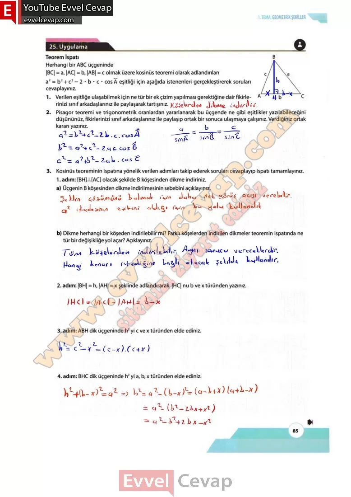

## 10. Sınıf Matematik Ders Kitabı Cevapları Meb Yayınları Sayfa 85

**25. Uygulama**

**Teorem İspatı**

**Soru: Herhangi bir ABC üçgeninde |BC| = a, |AC| = b, |AB| = c olmak üzere kosinüs teoremi olarak adlandırılan a2 = b2 + c2 – 2 • b • c • cos A eşitliği için aşağıda istenenleri gerçekleştirerek soruları cevaplayınız.**

**Soru: 1) Verilen eşitliğe ulaşabilmek için ne tür bir ek çizim yapılması gerektiğine dair fikirlerinizi sınıf arkadaşlarınız ile paylaşarak tartışınız.**

**Soru: 2) Pisagor teoremi ve trigonometrik oranlardan yararlanarak bu üçgende ne gibi eşitlikler yazılabileceğini düşününüz, fikirlerinizi sınıf arkadaşlarınız ile paylaşıp ortak bir sonuca ulaşmaya çalışınız. Verdiğiniz ortak kararı yazınız.**

**Soru: 3) Kosinüs teoreminin ispatına yönelik verilen adımları takip ederek soruları cevaplayıp ispatı tamamlayınız.**

**Soru: [BH] [AC] olacak şekilde B köşesinden dikme indiriniz,**

**Soru: a) Üçgenin B köşesinden dikme indirilmesinin sebebini açıklayınız.**

**Soru: b) Dikme herhangi bir köşeden indirilebilir mi? Farklı köşelerden indirilen dikmeler teoremin ispatında ne tür bir değişikliğe yol açar? Açıklayınız.**

**Soru: |BH| = h, |AH| = x şeklinde adlandırarak |HC| nu b ve x türünden yazınız.**

**Soru: ABH dik üçgeninde h2 yi c ve x türünden elde ediniz.**

**Soru: BHC dik üçgeninde h2 yi a, b, x türünden elde ediniz.**

**10. Sınıf Meb Yayınları Matematik Ders Kitabı Sayfa 85**