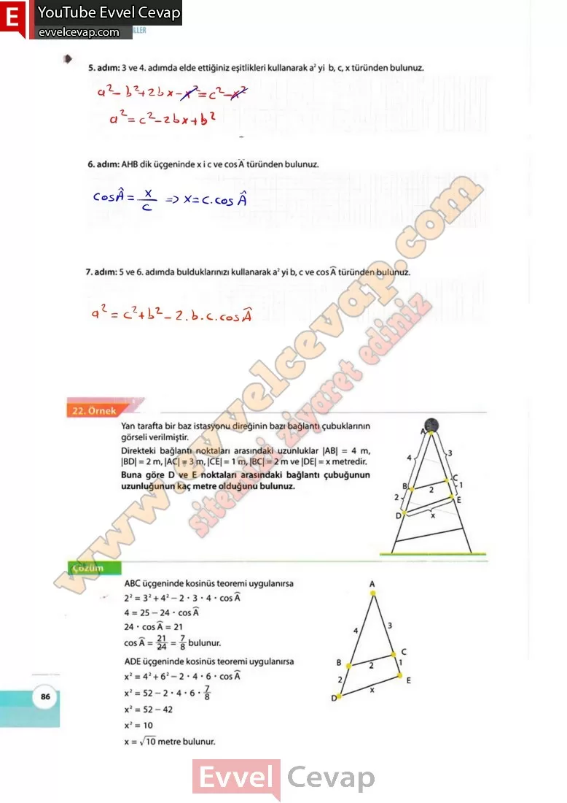

## 10. Sınıf Matematik Ders Kitabı Cevapları Meb Yayınları Sayfa 86

**Soru: 3 ve 4. adımda elde ettiğiniz eşitlikleri kullanarak a2 yi b, c, x türünden bulunuz.**

**Soru: AHB dik üçgeninde x i c ve cos A türünden bulunuz.**

**Soru: 5 ve 6. adımda bulduklarınızı kullanarak a2 yi b, c ve cos A türünden bulunuz.**

Yan tarafta bir baz istasyonu direğinin bazı bağlantı çubuklarının görseli verilmiştir.  
 Direkteki bağlantı noktaları arasındaki uzunluklar |AB| = 4 m, |BD| = 2 m, |ACj = 3 m, |CE| = 1 m, |BC| = 2 m ve |DE| = x metredir.  
 Buna göre D ve E noktaları arasındaki bağlantı çubuğunun uzunluğunun kaç metre olduğunu bulunuz.

**10. Sınıf Meb Yayınları Matematik Ders Kitabı Sayfa 86**