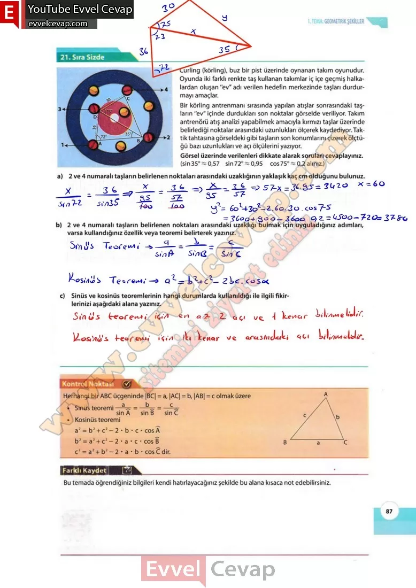

## 10. Sınıf Matematik Ders Kitabı Cevapları Meb Yayınları Sayfa 87

**Sıra Sizde**

Curling (körling), buz bir pist üzerinde oynanan takım oyunudur. Oyunda iki farklı renkte taş kullanan takımlar iç içe geçmiş halkalardan oluşan “ev” adı verilen hedefin merkezinde taşları durdurmayı amaçlar. Bir körling antrenmanı sırasında yapılan atışlar sonrasındaki taşların “ev” içinde durdukları son noktalar görselde veriliyor. Takım antrenörü atış analizi yapabilmek amacıyla kırmızı taşlar üzerinde belirlediği noktalar arasındaki uzunlukları ölçerek kaydediyor. Taktik tahtasına görseldeki gibi taşların son konumlarını çizerek ölçtüğü bazı uzunlukları ve açı ölçülerini yazıyor.

**Soru: Görsel üzerinde verilenleri dikkate alarak soruları cevaplayınız,**

**Soru: a) 2 ve 4 numaralı taşların belirlenen noktaları arasındaki uzaklığının yaklaşık kaç cm olduğunu bulunuz.**

**Soru: b) 2 ve 4 numaralı taşların belirlenen noktaları arasındaki uzaklığı bulmak için uyguladığınız adımları, varsa kullandığınız özellik veya teoremi belirterek yazınız.**

**Soru: c) Sinüs ve kosinüs teoremlerinin hangi durumlarda kullanıldığı ile ilgili fikirlerinizi aşağıdaki alana yazınız.**

**Soru: Bu temada öğrendiğiniz bilgileri kendi hatırlayacağınız şekilde bu alana kısaca not edebilirsiniz.**

**10. Sınıf Meb Yayınları Matematik Ders Kitabı Sayfa 87**