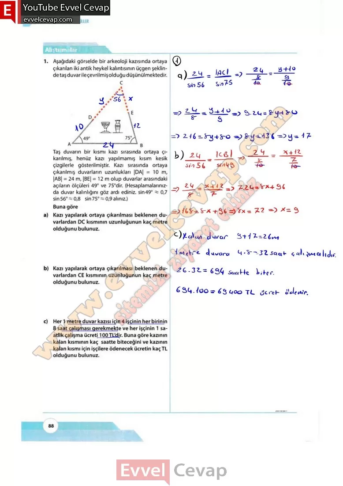
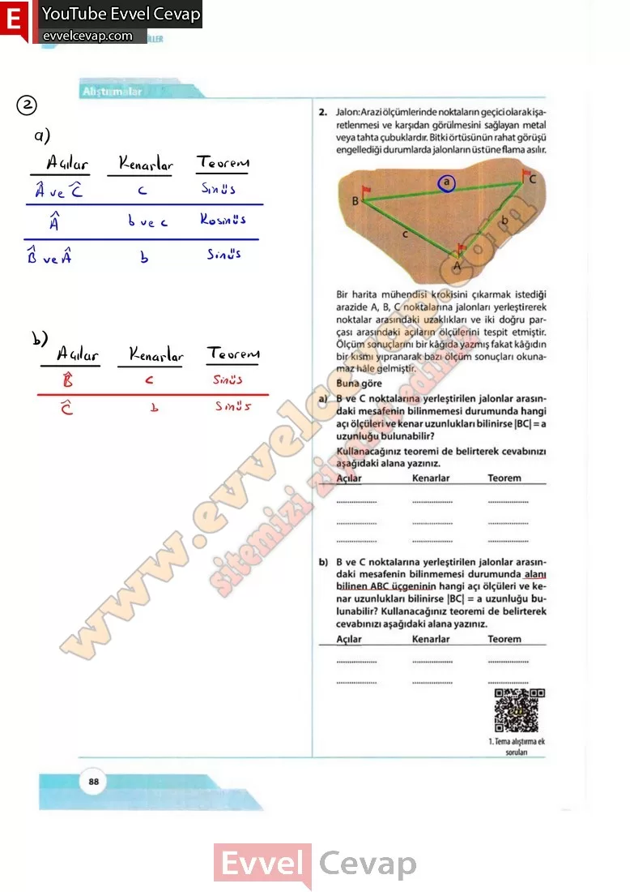

## 10. Sınıf Matematik Ders Kitabı Cevapları Meb Yayınları Sayfa 88

**Alıştırmalar**

**Soru: 1) Aşağıdaki görselde bir arkeoloji kazısında ortaya 2. çıkarılan iki antik heykel kalıntısının üçgen şeklinde taş duvar ile çevrilmiş olduğu düşünülmektedir. karılmış, henüz kazı yapılmamış kısım kesik çizgilerle gösterilmiştir. Kazı sırasında ortaya çıkarılmış duvarların uzunlukları |DA| = 10 m, |AB| = 24 m, |BE| = 12 m olup duvarlar arasındaki açıların ölçüleri 49° ve 75°dir. (Hesaplamalarınızda duvar kalınlığını göz ardı ediniz. sin49° ~ 0,7 sin 56° ~ 0,8 sin 75° ~ 0,9 alınız.) Buna göre**

**Soru: a) Kazı yapılarak ortaya çıkarılması beklenen duvarlardan DC kısmının uzunluğunun kaç metre olduğunu bulunuz.**

**Soru: b) Kazı yapılarak ortaya çıkarılması beklenen duvarlardan CE kısmının uzunluğunun kaç metre olduğunu bulunuz.**

**Soru: c) Her 1 metre duvar kazısı için 4 işçinin her birinin 8 saat çalışması gerekmekte ve her işçinin 1 saatlik çalışma ücreti100TL’dir. Buna göre kazının kalan kısmının kaç saatte biteceğini ve kazının kalan kısmı için işçilere ödenecek ücretin kaç TL olduğunu bulunuz.**

**Soru: 2)** Jalon: Arazi ölçümlerinde noktaların geçici olarak işaretlenmesi ve karşıdan görülmesini sağlayan metal veya tahta çubuklardır. Bitki örtüsünün rahat görüşü engellediği durumlarda jalonların üstüne flama asılır. Bir harita mühendisi krokisini çıkarmak istediği arazide A, B, C noktalarına jaloniarı yerleştirerek noktalar arasındaki uzaklıkları ve iki doğru parçası arasındaki açıların ölçülerini tespit etmiştir. **Ölçüm sonuçlarını bir kâğıda yazmış fakat kâğıdın bir kısmı yıpranarak bazı ölçüm sonuçları okunamaz hâle gelmiştir. Buna göre**

**Soru: a) B ve C noktalarına yerleştirilen balonlar arasındaki mesafenin bilinmemesi durumunda hangi açı ölçüleri ve kenar uzunlukları bilinirse |BC| = a uzunluğu bulunabilir? Kullanacağınız teoremi de belirterek cevabınızı aşağıdaki alana yazınız.**

**Soru: b) B ve C noktalarına yerleştirilen balonlar arasındaki mesafenin bilinmemesi durumunda alanı bilinen ABC üçgeninin hangi açı ölçüleri ve kenar uzunlukları bilinirse |BC| = a uzunluğu bulunabilir? Kullanacağınız teoremi de belirterek cevabınızı aşağıdaki alana yazınız.**

  
 

**10. Sınıf Meb Yayınları Matematik Ders Kitabı Sayfa 88**