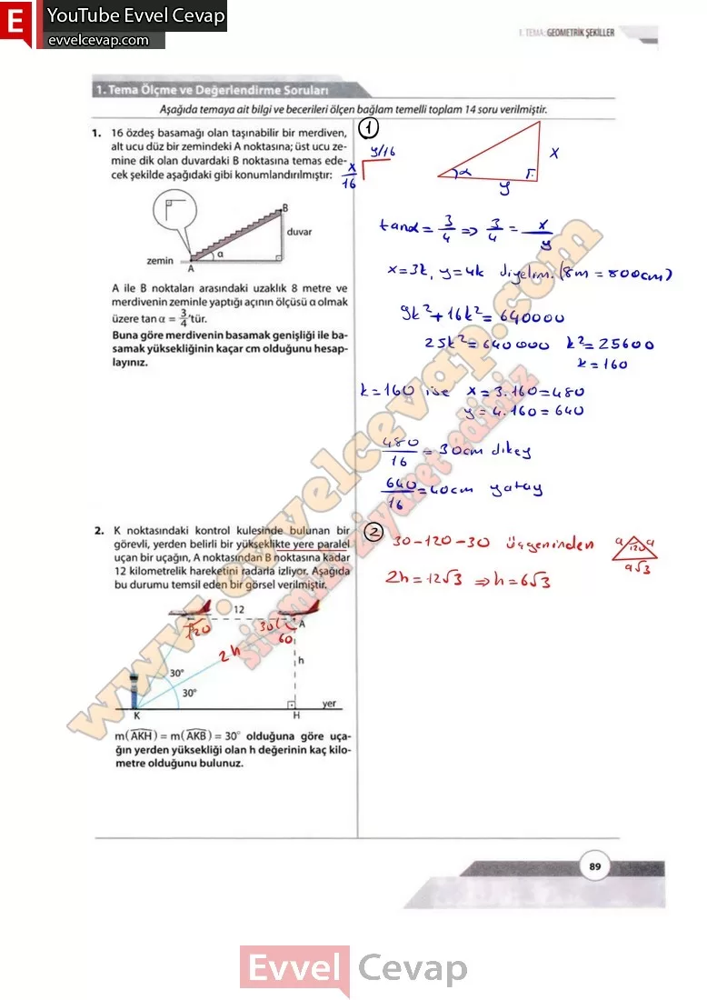
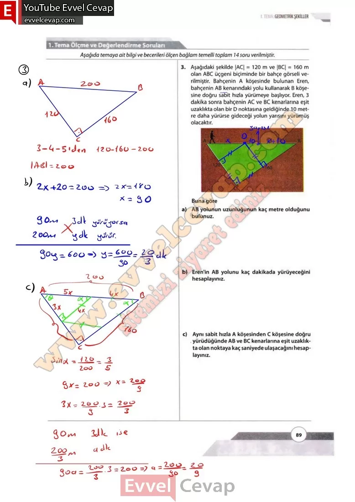

## 10. Sınıf Matematik Ders Kitabı Cevapları Meb Yayınları Sayfa 89

**1. Tema Ölçme ve Değerlendirme Soruları**

**Soru: 1) 16 özdeş basamağı olan taşınabilir bir merdiven, alt ucu düz bir zemindeki A noktasına; üst ucu zemine dik olan duvardaki B noktasına temas edecek şekilde aşağıdaki gibi konumlandırılmıştır: A ile B noktaları arasındaki uzaklık 8 metre ve merdivenin zeminle yaptığı açının ölçüsü a olmak üzere tan a 3/4’tür. Buna göre merdivenin basamak genişliği ile ba- samakyüksekliğinin kaçar cm olduğunu hesaplayınız.**

**Soru: 2) K noktasındaki kontrol kulesinde bulunan bir görevli, yerden belirli bir yükseklikte yere paralel uçan bir uçağın, A noktasından B noktasına kadar 12 kilometrelik hareketini radarla izliyor. Aşağıda bu durumu temsil eden bir görsel verilmiştir. m(AKH) = m(AKB) = 30° olduğuna göre uçağın yerden yüksekliği olan h değerinin kaç kilometre olduğunu bulunuz.**

**Soru: 3) Aşağıdaki şekilde |AC| = 120 m ve |BC| = 160 m olan ABC üçgeni biçiminde bir bahçe görseli verilmiştir. Bahçenin A köşesinde bulunan Eren, bahçenin AB kenarındaki yolu kullanarak B köşesine doğru sabit hızla yürümeye başlıyor. Eren, 3 dakika sonra bahçenin AC ve BC kenarlarına eşit uzaklıkta olan bir D noktasına geldiğinde 10 metre daha yürürse gideceği yolun yarısını yürümüş olacaktır. Buna göre**

**Soru: a) AB yolunun uzunluğunun kaç metre olduğunu bulunuz.**

**Soru: b) Eren’in AB yolunu kaç dakikada yürüyeceğini hesaplayınız.**

**Soru: c) Aynı sabit hızla A köşesinden C köşesine doğru , yürüdüğünde AB ve BC kenarlarına eşit uzaklıkta olan noktaya kaç saniyede ulaşacağını hesaplayınız.**

  
 

**10. Sınıf Meb Yayınları Matematik Ders Kitabı Sayfa 89**