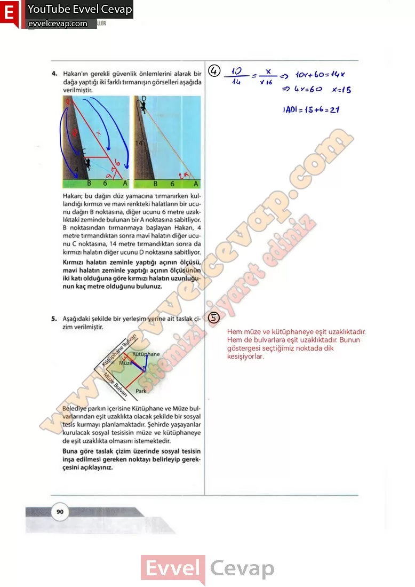
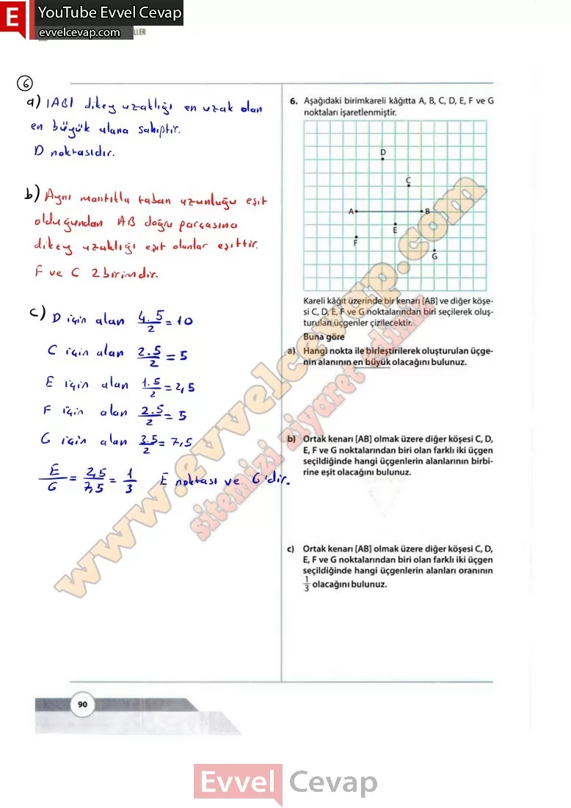

## 10. Sınıf Matematik Ders Kitabı Cevapları Meb Yayınları Sayfa 90

**Soru: 4)** Hakan’ın gerekli güvenlik önlemlerini alarak bir dağa yaptığı iki farklı tırmanışın görselleri aşağıda verilmiştir. Hakan; bu dağın düz yamacına tırmanırken kullandığı kırmızı ve mavi renkteki halatların bir ucunu dağın B noktasına, diğer ucunu 6 metre uzaklıktaki zeminde bulunan bir A noktasına sabitliyor. B noktasından tırmanmaya başlayan Hakan, 4 metre tırmandıktan sonra mavi halatın diğer ucunu C noktasına, 14 metre tırmandıktan sonra da kırmızı halatın diğer ucunu D noktasına sabitliyor. **Kırmızı halatın zeminle yaptığı açının ölçüsü, mavi halatın zeminle yaptığı açının ölçüsünün iki katı olduğuna göre kırmızı halatın uzunluğunun kaç metre olduğunu bulunuz.**

**Soru: 5) Aşağıdaki şekilde bir yerleşim yerine ait taslak çizim verilmiştir. Belediye parkın içerisine Kütüphane ve Müze bulvarlarından eşit uzaklıkta olacak şekilde bir sosyal tesis kurmayı planlamaktadır. Şehirde yaşayanlar kurulacak sosyal tesisisin müze ve kütüphaneye de eşit uzaklıkta olmasını istemektedir. Buna göre taslak çizim üzerinde sosyal tesisin inşa edilmesi gereken noktayı belirleyip gerekçesini açıklayınız.**

**Soru: 6) Aşağıdaki birimkareli kâğıtta A, B, C, D, E, F ve G noktaları işaretlenmiştir. Kareli kâğıt üzerinde bir kenarı [AB] ve diğer köşesi C, D, E, F ve G noktalarından biri seçilerek oluşturulan üçgenler çizilecektir. Buna göre**

**Soru: a) Hangi nokta ile birleştirilerek oluşturulan üçgenin alanının en büyük olacağım bulunuz.**

**Soru: b) Ortak kenarı [AB] olmak üzere diğer köşesi C, D, E, F ve G noktalarından biri olan farklı iki üçgen seçildiğinde hangi üçgenlerin alanlarının birbirine eşit oiacağını bulunuz.**

**Soru: c) Ortak kenarı [AB] olmak üzere diğer köşesi C, D, E, F ve G noktalarından biri olan farklı iki üçgen seçildiğinde hangi üçgenlerin alanları oranının 1/3 olacağını bulunuz.**

  
 

**10. Sınıf Meb Yayınları Matematik Ders Kitabı Sayfa 90**