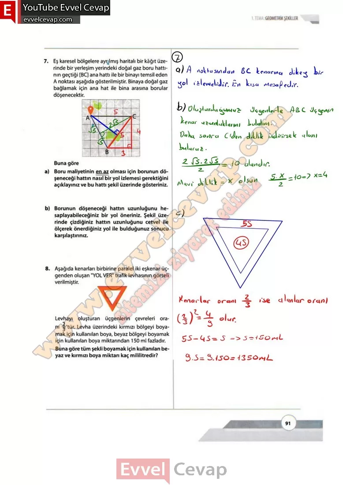
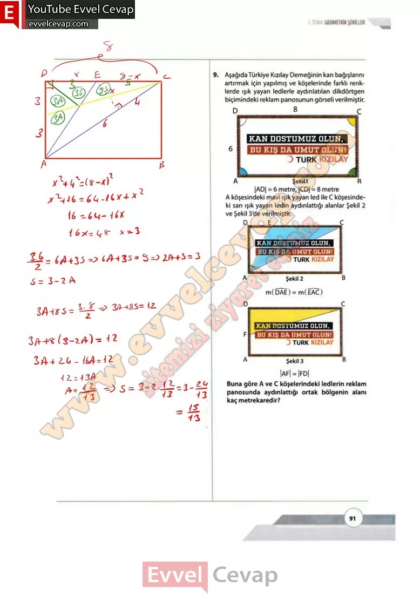

## 10. Sınıf Matematik Ders Kitabı Cevapları Meb Yayınları Sayfa 91

**Soru: 7) Eş karesel bölgelere ayrılmış haritalı bir kâğıt üzerinde bir yerleşim yerindeki doğal gaz boru hattının geçtiği [BC] ana hattı ile bir binayı temsil eden A noktası aşağıda gösterilmiştir. Binaya doğal gaz bağlamak için ana hat ile bina araşma borular döşenecektir. Buna göre**

**Soru: a) Boru maliyetinin en az olması için borunun döşeneceği hattın nasıl bir yol izlemesi gerektiğini açıklayınız ve bu hattı şekil üzerinde gösteriniz.**

**Soru: b) Borunun döşeneceği hattın uzunluğunu hesaplayabileceğiniz bir yol öneriniz. Şekil üzerinde çizdiğiniz hattın uzunluğunu cetvel ile ölçerek önerdiğiniz yol ile bulduğunuz sonucu karşılaştırınız.**

**Soru: 8) Aşağıda kenarları birbirine paralel iki eşkenar üçgenden oluşan “YOL VER” trafik levhasının görseli verilmiştir. Levhayı oluşturan üçgenlerin çevreleri oranı 2/3’tür. Levha üzerindeki kırmızı bölgeyi boyamak için kullanılan boya, beyaz bölgeyi boyamak için kullanılan boya miktarından 150 mİ fazladır. Buna göre tüm şekli boyamak için kullanılan beyaz ve kırmızı boya miktarı kaç mililitredir?**

**Soru: 9) Aşağıda Türkiye Kızılay Derneğinin kan bağışlarını artırmak için yapılmış ve köşelerinde farklı renklerde ışık yayan ledlerle aydınlatılan dikdörtgen biçimindeki reklam panosunun görseli verilmiştir. A köşesindeki mavi ışık yayan led ile C köşesindeki sarı ışık yayan ledin aydınlattığı alanlar Şekil 2 ve Şekil 3’de verilmiştir. Buna göre A ve C köşelerindeki ledlerin reklam panosunda aydınlattığı ortak bölgenin alanı kaç metrekaredir?**

  
 

**10. Sınıf Meb Yayınları Matematik Ders Kitabı Sayfa 91**