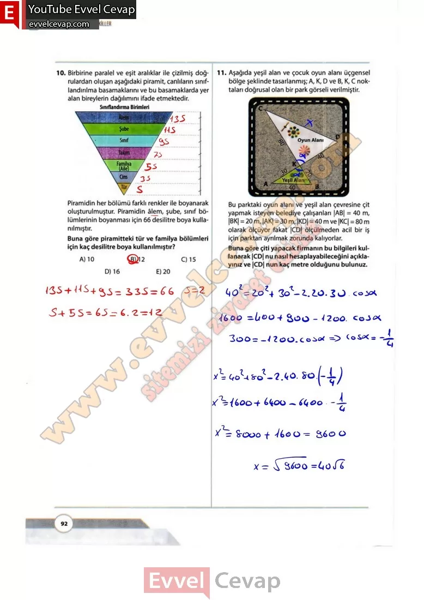

## 10. Sınıf Matematik Ders Kitabı Cevapları Meb Yayınları Sayfa 92

**Soru: 10) Birbirine paralel ve eşit aralıklar ile çizilmiş doğrulardan oluşan aşağıdaki piramit, canlıların sınıflandırılma basamaklarını ve bu basamaklarda yer alan bireylerin dağılımını ifade etmektedir. Piramidin her bölümü farklı renkler ile boyanarak oluşturulmuştur. Piramidin âlem, şube, sınıf bölümlerinin boyanması için 66 desilitre boya kullanılmıştır. Buna göre piramitteki tür ve familya bölümleri için kaç desilitre boya kullanılmıştır?**

A) 10  
 B) 12  
 C)15  
 D) 16  
 E) 20

**Soru: 11)** Aşağıda yeşil alan ve çocuk oyun alanı üçgensel bölge şeklinde tasarlanmış; A, K, D ve B, K, C noktaları doğrusal olan bir park görseli verilmiştir. Bu parktaki oyun alanı ve yeşil alan çevresine çit yapmak isteyen belediye çalışanları |AB| = 40 m, |BK| = 20 m, |AK| = 30 m, |KD| = 40 m ve |KC| = 80 m olarak ölçüyor fakat |CD| ölçülmeden acil bir iş için parktan ayrılmak zorunda kalıyorlar.**Buna göre çiti yapacak firmanın bu bilgileri kullanarak |CD| nu nasıl hesaplayabileceğini açıklayınız ve |CD| nun kaç metre olduğunu bulunuz.**

**10. Sınıf Meb Yayınları Matematik Ders Kitabı Sayfa 92**