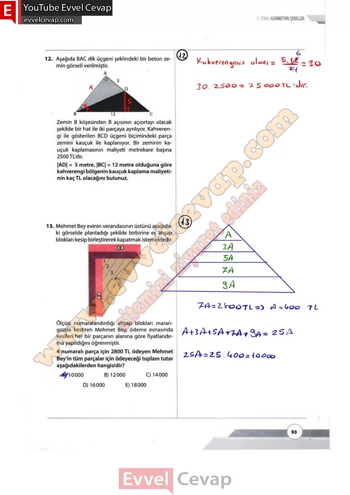
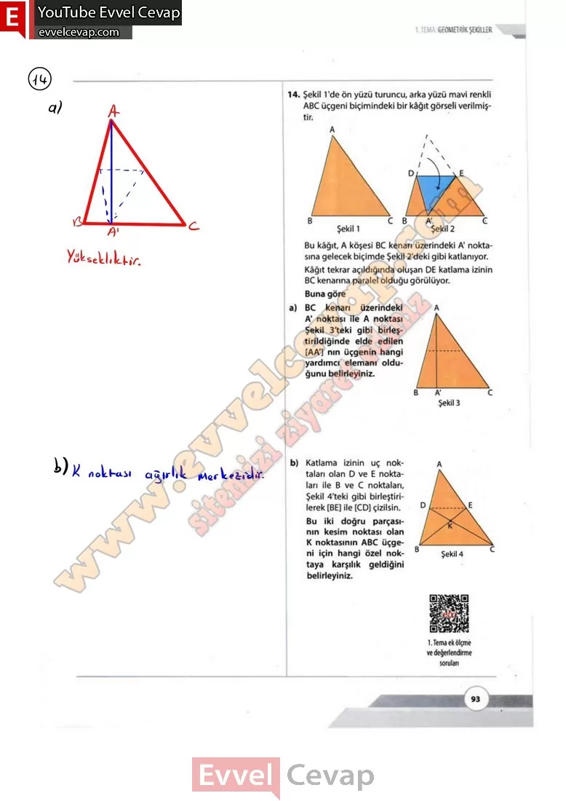

## 10. Sınıf Matematik Ders Kitabı Cevapları Meb Yayınları Sayfa 93

**Soru: 12) Zemin B köşesinden B açısının açıortayı olacak şekilde bir hat ile iki parçaya ayrılıyor. Kahverengi ile gösterilen BCD üçgeni biçimindeki parça zemini kauçuk ile kaplanıyor. Bir zeminin kauçuk kaplamasının maliyeti metrekare başına 2500 TL’dir. |AD| = 5 metre, |BC| = 12 metre olduğuna göre kahverengi bölgenin kauçuk kaplama maliyetinin kaç TL olacağını bulunuz.**

**Soru: 13) Mehmet Bey evinin verandasının üstünü aşağıdaki görselde planladığı şekilde birbirine eş ahşap blokları kesip birleştirerek kapatmak istemektedir. Ölçüp numaralandırdığı ahşap blokları marangozda kestiren Mehmet Bey, ödeme esnasında kesilen her bir parçanın alanına göre fiyatlandırma yapıldığını öğrenmiştir. 4 numaralı parça için 2800 TL ödeyen Mehmet Bey’in tüm parçalar için ödeyeceği toplam tutar aşağıdakilerden hangisidir?**

A) 10000  
 B) 12000  
 C) 14000  
 D) 16000  
 E) 18000

**Soru: 14) Şekil 1’de ön yüzü turuncu, arka yüzü mavi renkli ABC üçgeni biçimindeki bir kâğıt görseli verilmiştin Bu kâğıt, A köşesi BC kenarı üzerindeki A’ noktasına gelecek biçimde Şekil 2’deki gibi katlanıyor. Kâğıt tekrar açıldığında oluşan DE katlama izinin BC kenarına paralel olduğu görülüyor. Buna göre**

**Soru: a) BC kenarı üzerindeki A A1 noktası ile A noktası Şekil 3’teki gibi birleştirildiğinde elde edilen [AA] nın üçgenin hangi yardımcı elemanı olduğunu belirleyiniz.**

**Soru: b) Katlama izinin uç noktaları olan D ve E noktaları ile B ve C noktaları, Şekil 4’teki gibi birleştirilerek [BE] ile [CD] çizilsin. Bu iki doğru parçasının kesim noktası olan K noktasının ABC üçgeni için hangi özel noktaya karşılık geldiğini belirleyiniz.**

  
 

**10. Sınıf Meb Yayınları Matematik Ders Kitabı Sayfa 93**