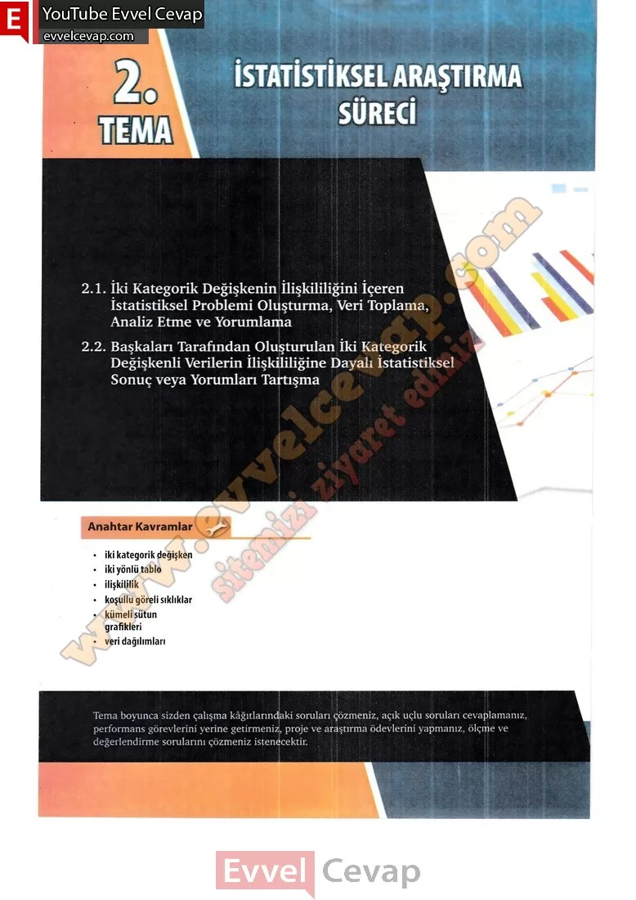

## 10. Sınıf Matematik Ders Kitabı Cevapları Meb Yayınları Sayfa 94

2.1. İki Kategorik Değişkenin İlişkililiğini İçeren İstatistiksel Problemi Oluşturma, Veri Toplama, Analiz Etme ve Yorumlama  
 2.2. Başkaları Tarafından Oluşturulan İki Kategorik Değişkenli Verilerin İlişkililiğine Dayalı İstatistiksel Sonuç veya Yorumları Tartışma

**Anahtar Kavramlar**

• iki kategorik değişken  
 • iki yönlü tablo  
 • ilişkiliiik  
 • koşullu göreli sıklıklar  
 • kümeli sütun grafikleri  
 • veri dağılımları

* **Cevap**: **Bu sayfada soru bulunmamaktadır.**

**10. Sınıf Meb Yayınları Matematik Ders Kitabı Sayfa 94**