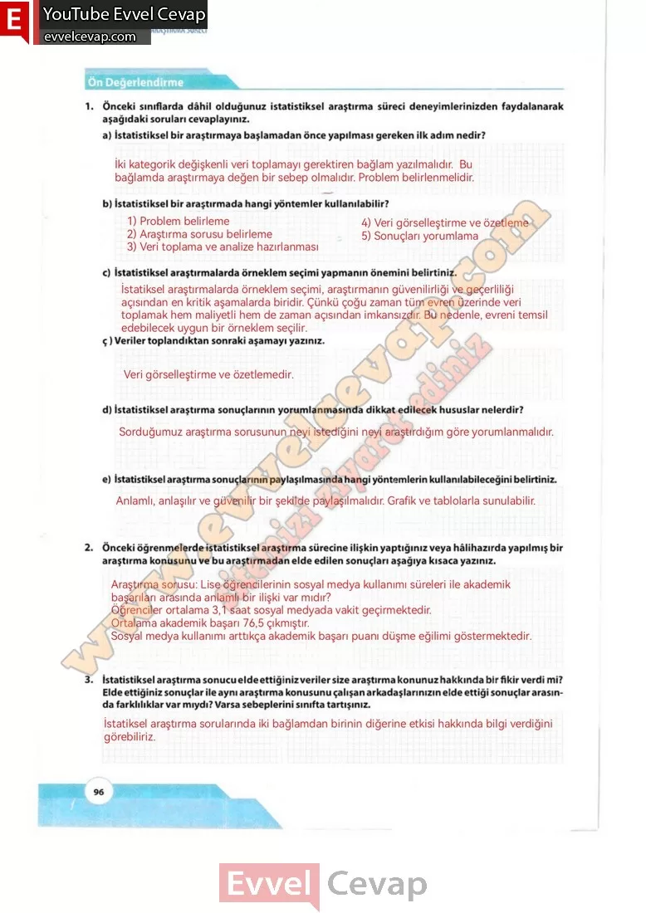

## 10. Sınıf Matematik Ders Kitabı Cevapları Meb Yayınları Sayfa 96

**Ön Değerlendirme**

**Soru: 1) Önceki sınıflarda dâhil olduğunuz istatistiksel araştırma süreci deneyimlerinizden faydalanarak aşağıdaki soruları cevaplayınız.**

**Soru: a) İstatistiksel bir araştırmaya başlamadan önce yapılması gereken ilk adım nedir?**

**Soru: b) İstatistiksel bir araştırmada hangi yöntemler kullanılabilir?**

**Soru: c) İstatistiksel araştırmalarda örneklem seçimi yapmanın önemini belirtiniz.**

**Soru: ç) Veriler toplandıktan sonraki aşamayı yazınız.**

**Soru: d) İstatistiksel araştırma sonuçlarının yorumlanmasında dikkat edilecek hususlar nelerdir?**

**Soru: e) İstatistiksel araştırma sonuçlarının paylaşılmasında hangi yöntemlerin kullanılabileceğini belirtiniz.**

**Soru: 2) Önceki öğrenmelerde istatistiksel araştırma sürecine ilişkin yaptığınız veya hâlihazırda yapılmış bir araştırma konusunu ve bu araştırmadan elde edilen sonuçları aşağıya kısaca yazınız.**

**Soru: 3) İstatistiksel araştırma sonucu elde ettiğiniz veriler size araştırma konunuz hakkında bir fikir verdi mi? Elde ettiğiniz sonuçlar ile aynı araştırma konusunu çalışan arkadaşlarınızın elde ettiği sonuçlar arasında farklılıklar var mıydı? Varsa sebeplerini sınıfta tartışınız.**

**10. Sınıf Meb Yayınları Matematik Ders Kitabı Sayfa 96**