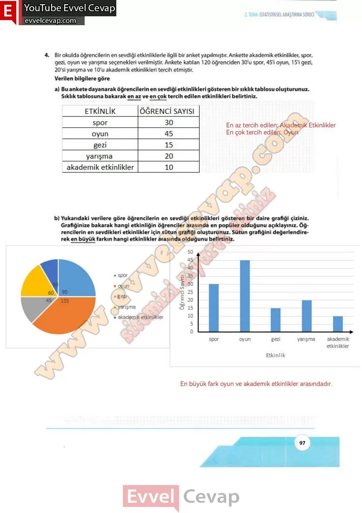
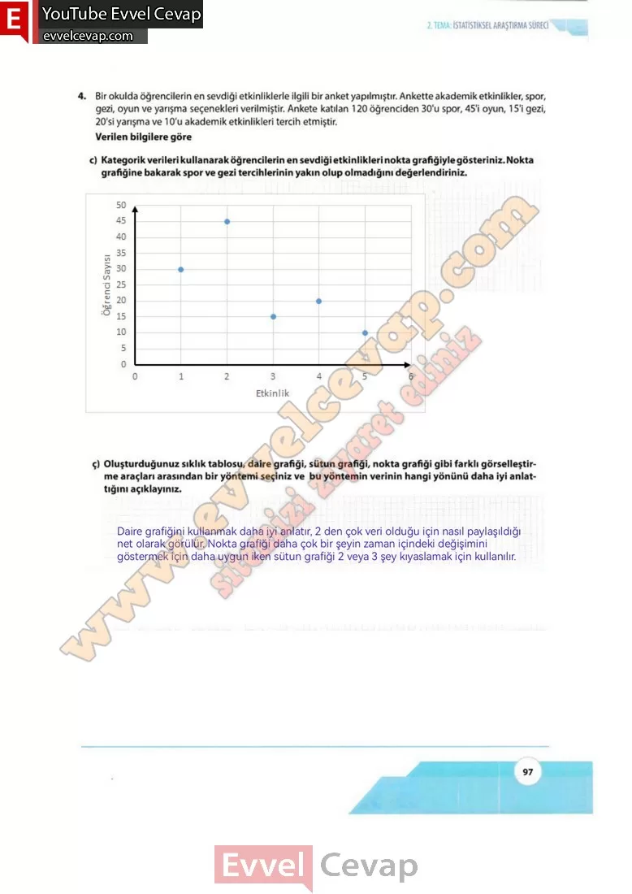

## 10. Sınıf Matematik Ders Kitabı Cevapları Meb Yayınları Sayfa 97

**Soru: 4) Bir okulda öğrencilerin en sevdiği etkinliklerle ilgili bir anket yapılmıştır. Ankette akademik etkinlikler, spor, gezi, oyun ve yarışma seçenekleri verilmiştir. Ankete katılan 120 öğrenciden 30’u spor, 45’i oyun, 15’i gezi, 20’si yarışma ve 10’u akademik etkinlikleri tercih etmiştir. Verilen bilgilere göre**

**Soru: a) Bu ankete dayanarak öğrencilerin en sevdiği etkinlikleri gösteren bir sıklık tablosu oluşturunuz. Sıklık tablosuna bakarak en az ve en çok tercih edilen etkinlikleri belirtiniz.**

**Soru: b) Yukarıdaki verilere göre öğrencilerin en sevdiği etkinlikleri gösteren bir daire grafiği çiziniz. Grafiğinize bakarak hangi etkinliğin öğrenciler arasında en popüler olduğunu açıklayınız. Öğrencilerin en sevdikleri etkinlikler için sütun grafiği oluşturunuz. Sütun grafiğini değerlendirerek en büyük farkın hangi etkinlikler arasında olduğunu belirtiniz.**

**Soru: c) Kategorik verileri kullanarak öğrencilerin en sevdiği etkinlikleri nokta grafiğiyle gösteriniz. Nokta grafiğine bakarak spor ve gezi tercihlerinin yakın olup olmadığını değerlendiriniz.**

**Soru: ç) Oluşturduğunuz sıklık tablosu, daire grafiği, sütun grafiği, nokta grafiği gibi farklı görselleştirme araçları arasından bir yöntemi seçiniz ve bu yöntemin verinin hangi yönünü daha iyi anlattığını açıklayınız.**

  
 

**10. Sınıf Meb Yayınları Matematik Ders Kitabı Sayfa 97**