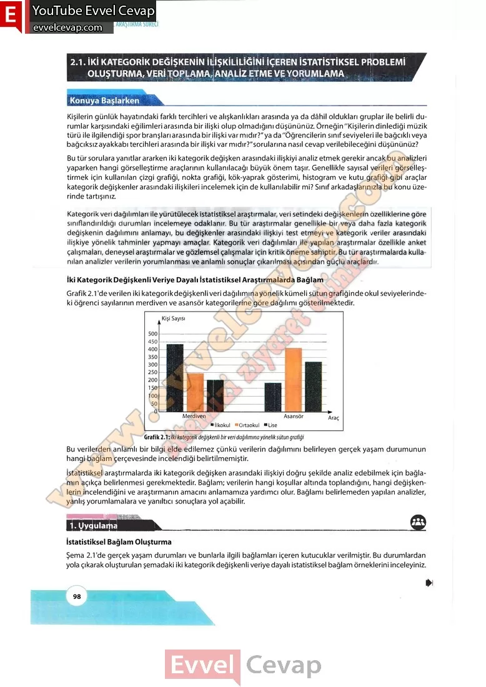

## 10. Sınıf Matematik Ders Kitabı Cevapları Meb Yayınları Sayfa 98

**Konuya Başlarken**

**Soru: Kişilerin günlük hayatındaki farklı tercihleri ve alışkanlıkları arasında ya da dâhil oldukları gruplar ile belirli durumlar karşısındaki eğilimleri arasında bir ilişki olup olmadığını düşününüz. Örneğin “Kişilerin dinlediği müzik türü ile ilgilendiği spor branşları arasında bir ilişki var mıdır?”ya da”Öğrencilerin sınıf seviyeleri ile bağcıklı veya bağcıksız ayakkabı tercihleri arasında bir ilişki var mıdır?”sorularına nasıl cevap verilebileceğini düşününüz?**

**Soru: Bu tür sorulara yanıtlar ararken iki kategorik değişken arasındaki ilişkiyi analiz etmek gerekir ancak bu analizleri yaparken hangi görselleştirme araçlarının kullanılacağı büyük önem taşır. Genellikle sayısal verileri görselleştirmek için kullanılan çizgi grafiği, nokta grafiği, kök-yaprak gösterimi, histogram ve kutu grafiği gibi araçlar kategorik değişkenler arasındaki ilişkileri incelemek için de kullanılabilir mi? Sınıf arkadaşlarınızla bu konu üzerinde tartışınız.**

Kategorik veri dağılımları ile yürütülecek istatistiksel araştırmalar, veri setindeki değişkenlerin özelliklerine göre sınıflandırdığı durumları incelemeye odaklanır. Bu tür araştırmalar genellikle bir veya daha fazla kategorik değişkenin dağılımını anlamayı, bu değişkenler arasındaki ilişkiyi test etmeyi ve kategorik veriler arasındaki ilişkiye yönelik tahminler yapmayı amaçlar. Kategorik veri dağılımları ile yapılan araştırmalar özellikle anket çalışmaları, deneysel araştırmalar ve gözlemsel çalışmalar için kritik öneme sahiptir. Bu tür araştırmalarda kullanılan analizler verilerin yorumlanması ve anlamlı sonuçlar çıkarılması açısından güçlü araçlardır.

Grafik 2.1 ‘de verilen iki kategorik değişkenli veri dağılımına yönelik kümeli sütun grafiğinde okul seviyelerindeki öğrenci sayılarının merdiven ve asansör kategorilerine göre dağılımı gösterilmektedir.

Bu verilerden anlamlı bir bilgi elde edilemez çünkü verilerin dağılımını belirleyen gerçek yaşam durumunun hangi bağlam çerçevesinde incelendiği belirtilmemiştir.  
 İstatistiksel araştırmalarda iki kategorik değişken arasındaki ilişkiyi doğru şekilde analiz edebilmek için bağlamın açıkça belirlenmesi gerekmektedir. Bağlam; verilerin hangi koşullar altında toplandığını, hangi değişkenlerin incelendiğini ve araştırmanın amacını anlamamıza yardımcı olur. Bağlamı belirlemeden yapılan analizler, yanlış yorumlamalara ve yanıltıcı sonuçlara yol açabilir.

**1. Uygulama**

**İstatistiksel Bağlam Oluşturma**

**Soru: Şema 2.1’de gerçek yaşam durumları ve bunlarla ilgili bağlamları içeren kutucuklar verilmiştir. Bu durumlardan yola çıkarak oluşturulan şemadaki iki kategorik değişkenli veriye dayalı istatistiksel bağlam örneklerini inceleyiniz.**

**10. Sınıf Meb Yayınları Matematik Ders Kitabı Sayfa 98**