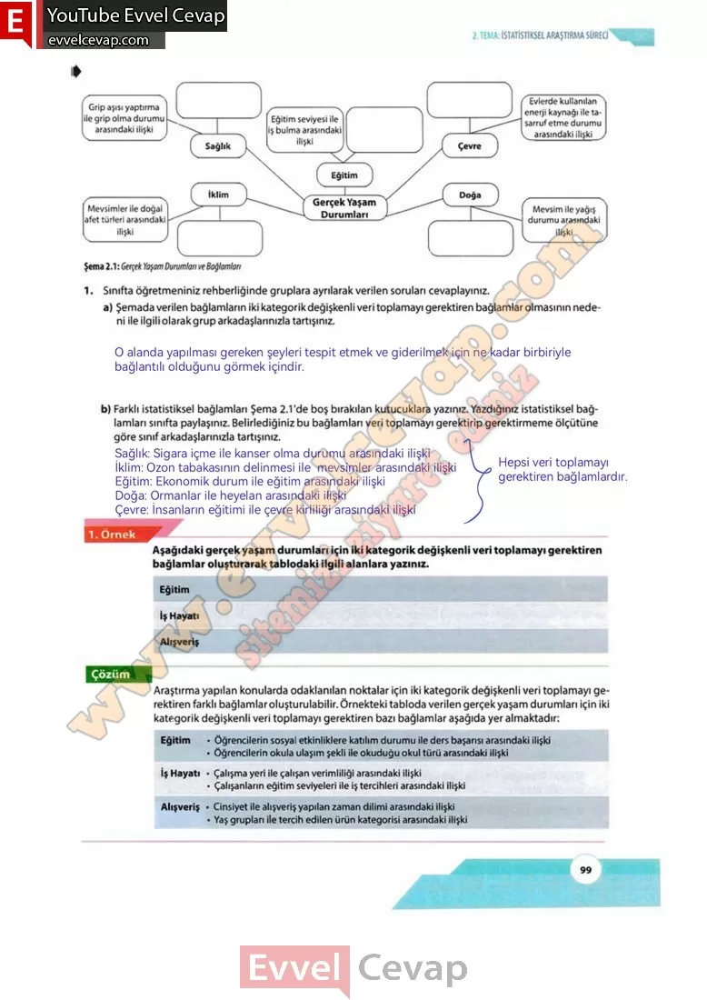

## 10. Sınıf Matematik Ders Kitabı Cevapları Meb Yayınları Sayfa 99

**Soru: 1) Sınıfta öğretmeniniz rehberliğinde gruplara ayrılarak verilen soruları cevaplayınız.**

**Soru: a) Şemada verilen bağlamların iki kategorik değişkenli veri toplamayı gerektiren bağlamlar olmasının nedeni ile ilgili olarak grup arkadaşlarınızla tartışınız.**

**Soru: b) Farklı istatistiksel bağlamları Şema 2.1’de boş bırakılan kutucuklara yazınız. Yazdığınız istatistiksel bağlamları sınıfta paylaşınız. Belirlediğiniz bu bağlamları veri toplamayı gerektirip gerektirmeme ölçütüne göre sınıf arkadaşlarınızla tartışınız.**

**Soru: 2) Karekodlarda verilen akran değerlendirme formu ile grup arkadaşlarınızı, öz değerlendirme formu ile de kendinizi değerlendiriniz.**

Aşağıdaki gerçek yaşam durumları için iki kategorik değişkenli veri toplamayı gerektiren bağlamlar oluşturarak tablodaki ilgili alanlara yazınız.

Araştırma yapılan konularda odaklanılan noktalar için iki kategorik değişkenli veri toplamayı gerektiren farklı bağlamlar oluşturulabilir. Örnekteki tabloda verilen gerçek yaşam durumları için iki kategorik değişkenli veri toplamayı gerektiren bazı bağlamlar aşağıda yer almaktadır:

**10. Sınıf Meb Yayınları Matematik Ders Kitabı Sayfa 99**